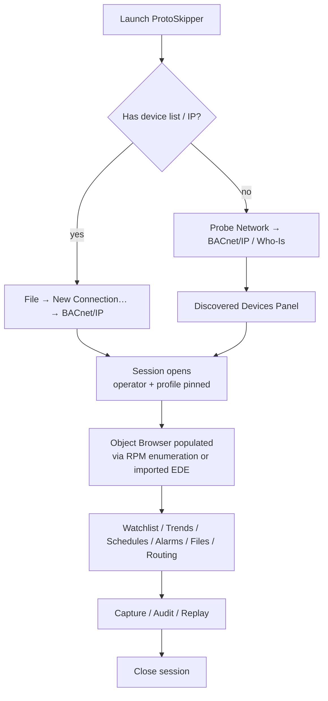

# BACnet/IP — UX, Feature, and Implementation Plan

> **Status:** In progress — P7.A and P7.B scaffolded. See progress markers in §8.
> **Scope:** ProtoSkipper Phase 7 (per `docs/ARCHITECTURE.md`).
> **Mission:** Build the BACnet client/server/test/commissioning toolkit
> that BMS engineers, controls integrators, and TAB technicians actually
> want to keep on their laptop — deliberately better than Polarsoft Visual
> Test Shell, BACnet Stack's VTS, Cimetrics BACnet Explorer, Chipkin CAS
> BACnet Explorer, and Yet Another BACnet Explorer (YABE).
> **Author:** ProtoSkipper maintainers (DataSailors).
>
> This document is the source of truth for the BACnet work. Every dialog,
> every field, every object type, every service, every test case is
> enumerated. The implementation plan at the bottom slots into Phase 7
> of `docs/internal/EXECUTION_PLAN.md` and replaces the three-task stub
> currently listed there.

---

## Table of contents

1. [Why we can win against the incumbents](#1-why-we-can-win-against-the-incumbents)
2. [Personas and primary journeys](#2-personas-and-primary-journeys)
3. [Feature catalog](#3-feature-catalog)
4. [Top-level UX flow](#4-top-level-ux-flow)
5. [Per-feature UX specification](#5-per-feature-ux-specification)
6. [Setup file format](#6-setup-file-format-bacnet-setup-json)
7. [Beyond-the-basics ambitions](#7-beyond-the-basics-ambitions)
8. [Implementation task breakdown](#8-implementation-task-breakdown)
9. [Cross-cutting test strategy](#9-cross-cutting-test-strategy)
10. [Open questions and risks](#10-open-questions-and-risks)

---

## 1. Why we can win against the incumbents

Reference points (the five tools we benchmarked against):

* **Polarsoft / SCC Visual Test Shell (VTS)** — the BTL test reference
  for BACnet. Powerful but archaic UI; Windows-only; almost
  unusable for day-to-day commissioning, only for vendor BTL labs.
* **Cimetrics BACnet Explorer** — solid commercial explorer; per-seat
  licence; Windows-only; UI from 2010.
* **Chipkin CAS BACnet Explorer** — popular among integrators; closed
  source; Windows-only; pricey for a small shop.
* **Yet Another BACnet Explorer (YABE)** — the de-facto free tool. WPF
  desktop app; Windows-only; active but single-maintainer; subscriptions
  and fault recovery are quirky.
* **Wireshark with the BACnet dissector** — best dissector around;
  passive viewer only.

Pain points and our response:

| Incumbent pain point | ProtoSkipper response |
|---|---|
| Windows-only across the board | Cross-platform (Linux, macOS, Windows) on the same engine. |
| Per-seat licence | GPL-3.0; runs on every laptop on the team. |
| Explorer-only — no server / device simulator | Built-in BACnet device simulator (impersonate any object list). |
| No COV-replay or trend-replay | First-class replay of captured BACnet/IP `.pcapng`; writes disabled in replay mode. |
| Routing through BBMD / FD is fiddly to configure | One-screen BBMD/FD wizard with live BDT/FDT visualisation. |
| MS/TP support is afterthought-or-absent | First-class MS/TP master and slave over RS-485, with token-passing diagnostics. |
| BACnet/SC (Secure Connect, Add. 135-2020 cl) is rarely supported | Native WebSocket client, hub, and direct connection roles, with TLS 1.2/1.3 and BACnet/SC certificate provisioning. |
| Trend log retrieval rarely works against odd vendors | TrendLog / TrendLogMultiple / EventLog retrieval with vendor-quirk profiles. |
| Schedule / Calendar editing is painful | Full WeeklySchedule + ExceptionSchedule + Calendar editor with timeline preview. |
| Fuzzing for BTL negative tests is absent | Built-in fuzzer with documented APDU/NPDU/BVLC mutations. |
| BIBB conformance testing requires VTS lab | UCAIug/ASHRAE BTL-aligned conformance profiles per device profile (B-OWS, B-AWS, B-BC, B-AAC, B-ASC, B-SA, B-SS, B-GW). |
| No BMS bench overview | Bench panel showing 100 devices, COV health, Present_Value of pinned points. |
| Audit log either absent or ad-hoc | HMAC-chained, append-only audit log per session (already shipped). |
| Vendor quirks (Trane Tracer, Honeywell EBI, JCI Metasys, Siemens APOGEE/Desigo, ABB, Schneider EBO) baked in by reverse-engineering | Open vendor profile library; community fixes. |
| No scripting | Python REPL with `bacnet.session.read("device:1234.AV1.present_value")`. |
| Discovery floods are uncontrolled | Stage discovery (one network at a time, configurable broadcast TTL, opt-in passive Who-Is sweep). |

The bar for Phase 7 is therefore: every must-have from the incumbents,
plus everything in the table above, plus hold the line on the
ProtoSkipper invariants (audit, safety profiles, plugin contract,
core-no-Qt, Read/write split).

---

## 2. Personas and primary journeys

### 2.1 Personas

* **P1 — BMS commissioning engineer.** On site at a building with a
  laptop and an Ethernet cable into the BMS VLAN. Has the points list
  from the controls contractor. Needs to: discover every controller,
  verify every point, commission a few setpoints, sign off.
* **P2 — Controls integrator / SI.** Office or van. Wires controllers
  from multiple vendors (JCI, Honeywell, Trane, Siemens, ABB,
  Schneider, Distech, Reliable, KMC, Delta) into one head-end. Needs
  multi-vendor compatibility test + diff against the Sequence-of-Operations.
* **P3 — TAB / re-commissioning technician.** Walks an existing
  building, samples zone temperatures, validates schedules, hunts
  override points that someone forgot to release.
* **P4 — OT cybersecurity auditor.** Wants packet captures, BACnet/SC
  certificate inspection, audit log, and a written record of what
  the test laptop did.
* **P5 — BACnet device vendor / BTL applicant.** Building a B-BC. Uses
  ProtoSkipper as the master to verify BIBB conformance before paying
  for a BTL test campaign.
* **P6 — BAS educator / researcher.** Teaches BACnet fundamentals;
  wants an interactive simulator with deterministic events and
  reproducible captures.

### 2.2 Primary journeys

The product must make all six succeed without training, on day 1, with
the customer's own points list.

1. **Discover-and-prove.** Plug in → "Probe BACnet/IP" → see every
   device on the network with vendor / model / firmware → time
   budget 30 s.
2. **Read a single point.** Right-click `AV:1` on device `1234` →
   "Read Present_Value" → 200 ms RTT shown → time budget 10 s.
3. **Override / Release a point.** Right-click `AO:3` → "Set
   Present_Value at priority 8" → safety dialog (in COMMISSIONING) →
   confirmation. Right-click → "Release at priority 8". Both audit
   rows visible. Time budget 30 s.
4. **Trend retrieval.** Pick a `TrendLog:1` → "Read range last 24 h" →
   table + plot → CSV export. Time budget 1 min.
5. **Schedule edit.** Open `Schedule:1` → drag a setpoint from
   `21 °C → 18 °C` between 18:00 Mon and 06:00 Tue → preview →
   commit. Audit row paired. Time budget 1 min.
6. **Replay last week's incident.** Drag-and-drop a `.pcapng` →
   filter by `Notification-Class:5` and `event-state ≠ normal` →
   see when the fault flood started. Time budget 30 s.

If any of these takes longer than budgeted, we have a UX bug.

---

## 3. Feature catalog

### 3.1 Must-haves (every BACnet tool ships these)

* **F1.** BACnet/IP client (BVLC: B/IP-V4 + B/IP-V6) per ANSI/ASHRAE
  135-2020 cl. 4.4 / Annex J / Annex U.
* **F2.** Service support — confirmed and unconfirmed (see §3.4).
* **F3.** Object support — every standard object type (see §3.5).
* **F4.** Property reads (`ReadProperty`, `ReadPropertyMultiple`,
  `ReadRange`).
* **F5.** Property writes (`WriteProperty`, `WritePropertyMultiple`),
  with priority-array awareness for commandable objects.
* **F6.** Discovery (`Who-Is` / `I-Am`, `Who-Has` / `I-Have`).
* **F7.** COV: `SubscribeCOV`, `SubscribeCOVProperty`,
  `SubscribeCOVPropertyMultiple`, with confirmed and unconfirmed
  notifications.
* **F8.** Alarm & event services (`ConfirmedEventNotification`,
  `UnconfirmedEventNotification`, `AcknowledgeAlarm`,
  `GetAlarmSummary`, `GetEnrollmentSummary`, `GetEventInformation`,
  `LifeSafetyOperation`).
* **F9.** TrendLog and TrendLogMultiple retrieval.
* **F10.** EventLog retrieval.
* **F11.** Schedule and Calendar object full edit/preview support.
* **F12.** File services (`AtomicReadFile`, `AtomicWriteFile`).
* **F13.** Device management (`DeviceCommunicationControl`,
  `ReinitializeDevice`, `TimeSynchronization`, `UTCTimeSynchronization`).
* **F14.** Routing — BBMD with BDT, Foreign Device with FDT,
  network-layer routing across subnets.
* **F15.** MS/TP master and slave over RS-485 (token passing,
  Reply-Postponed, etc.).
* **F16.** Audit log per session, HMAC-chained (already shipped at
  the core layer).

### 3.2 Differentiators (what beats the incumbents)

* **D1.** Master + Server-simulator + Analyzer + Fuzzer + Replayer in
  one product.
* **D2.** Bench overview: every discovered device with COV health,
  pinned points, last-seen, Out-of-Service flag, Reliability flag.
* **D3.** Drag-and-drop PCAP analyzer with full BACnet dissection
  (BVLC + NPDU + APDU + objects/properties).
* **D4.** Device simulator from a points-list CSV/EDE/AT file.
* **D5.** Fuzzer with documented BVLC/NPDU/APDU mutations.
* **D6.** Vendor profile library: JCI Metasys, Honeywell EBI/Niagara,
  Siemens APOGEE/Desigo, Trane Tracer, ABB Cylon, Schneider EBO,
  Distech Eclypse, Reliable Controls MACH, KMC Conquest, Delta
  enteliWEB — with their proprietary-property OIDs, vendor-private
  service mappings, and APDU-segmentation quirks pre-filled.
* **D7.** BACnet/SC native client + hub + direct connection role,
  with cert provisioning UI per Add. 135-2020-cl Annex YY.
* **D8.** BIBB conformance test runner with profiles aligned to
  BTL: B-OWS, B-AWS, B-BC, B-AAC, B-ASC, B-SA, B-SS, B-GW (gateway).
* **D9.** Schedule preview timeline (drag-edit then commit).
* **D10.** TrendLog visualisation with multi-trace overlay + CSV
  export + COMTRADE export (for cross-domain replay against IEC 61850
  SV captures).
* **D11.** Diff between expected (EDE / AT / spec spreadsheet) and
  actual (live RPM): instant "what's wrong with the points list".
* **D12.** Multi-network bench: one app, many networks, BBMD-routed
  visualisation showing the BACnet internetwork as a graph.
* **D13.** Scripting: every operation available from REPL and from
  `protoskipper run script.py`.
* **D14.** Companion-standard awareness: ASHRAE 135-2020 + addenda,
  BACnet/SC primer, BTL Specified Tests cross-reference.

### 3.3 Stretch (research / nice-to-have)

* **S1.** BACnet/Zigbee, BACnet/LON gateways (read-only viewer).
* **S2.** BACnet over MQTT (research; non-standard transport).
* **S3.** Cross-protocol bridging: BACnet ↔ Modbus ↔ IEC 104 mapping
  table editor (define which BACnet AV maps to which Modbus register).
* **S4.** Wireshark dissector handoff: export `.pcapng` with
  protoskipper-flavoured Custom Block annotations (already partially
  in place via the P2.A.1 ProtoSkipper Protocol Block).
* **S5.** Multi-vendor interop matrix tracked publicly.
* **S6.** Energy-management object suite presets (per ASHRAE 135-2020
  Annex W demand-response objects).
* **S7.** Smart-grid-friendly scheduling (DERMS/DR signals injected as
  Schedule overrides for benchmarking).

### 3.4 Service catalogue (must be supported end-to-end)

Every service below: encode + decode + UI render + audit + replay.

**Alarm & Event services**
* AcknowledgeAlarm
* ConfirmedCOVNotification
* ConfirmedCOVNotificationMultiple
* ConfirmedEventNotification
* GetAlarmSummary
* GetEnrollmentSummary
* GetEventInformation
* LifeSafetyOperation
* SubscribeCOV
* SubscribeCOVProperty
* SubscribeCOVPropertyMultiple

**File access services**
* AtomicReadFile
* AtomicWriteFile

**Object access services**
* AddListElement
* RemoveListElement
* CreateObject
* DeleteObject
* ReadProperty
* ReadPropertyMultiple
* ReadRange
* WriteProperty
* WritePropertyMultiple
* WriteGroup (Add. 135-2020e)

**Remote device management services**
* DeviceCommunicationControl
* ConfirmedPrivateTransfer
* UnconfirmedPrivateTransfer
* ReinitializeDevice
* ConfirmedTextMessage
* UnconfirmedTextMessage
* TimeSynchronization
* UTCTimeSynchronization
* Who-Am-I (Add. 135-2020-cm)
* You-Are (Add. 135-2020-cm)

**Virtual terminal services** (legacy, but conformance-required)
* VT-Open
* VT-Close
* VT-Data

**Unconfirmed services**
* I-Am
* I-Have
* UnconfirmedCOVNotification
* UnconfirmedCOVNotificationMultiple
* UnconfirmedEventNotification
* UnconfirmedTextMessage
* TimeSynchronization (unconfirmed)
* UTCTimeSynchronization (unconfirmed)
* Who-Has
* Who-Is

**BVLC functions** (Annex J for B/IP, Annex U for B/IP-V6)
* BVLC-Result
* Write-Broadcast-Distribution-Table
* Read-Broadcast-Distribution-Table / -Ack
* Forwarded-NPDU
* Register-Foreign-Device
* Read-Foreign-Device-Table / -Ack
* Delete-Foreign-Device-Table-Entry
* Distribute-Broadcast-To-Network
* Original-Unicast-NPDU
* Original-Broadcast-NPDU
* Secure-BVLL (Add. 135-2020 Annex YY for SC)

**BACnet/SC (Secure Connect) BVLC**
* BVLC-Result, Encapsulated-NPDU, Address-Resolution,
  Address-Resolution-Ack, Advertisement, Advertisement-Solicitation,
  Connect-Request, Connect-Accept, Disconnect-Request,
  Disconnect-Ack, Heartbeat-Request, Heartbeat-Ack,
  Proprietary-Message.

### 3.5 Object catalogue (must be supported end-to-end)

Every standard object type per ASHRAE 135-2020 cl. 12. UI render +
property table + commandable awareness + COV awareness.

* AccessCredential, AccessDoor, AccessPoint, AccessRights,
  AccessUser, AccessZone, Accumulator, AlertEnrollment,
  AnalogInput, AnalogOutput, AnalogValue, Audit-Log, Audit-Reporter,
  Averaging, BinaryInput, BinaryLightingOutput, BinaryOutput,
  BinaryValue, BitstringValue, Calendar, Channel, CharacterstringValue,
  Command, CredentialDataInput, DatePatternValue, DateValue,
  DatetimePatternValue, DatetimeValue, Device, ElevatorGroup, Escalator,
  EventEnrollment, EventLog, File, GlobalGroup, Group, IntegerValue,
  LargeAnalogValue, LifeSafetyPoint, LifeSafetyZone, Lift,
  LightingOutput, Loop, MultiStateInput, MultiStateOutput,
  MultiStateValue, NetworkPort, NetworkSecurity, NotificationClass,
  NotificationForwarder, OctetstringValue, PositiveIntegerValue,
  Program, PulseConverter, Schedule, StagingHumidifier (Add. proposal),
  StagingValue, StructuredView, TimePatternValue, TimeValue, Timer,
  TrendLog, TrendLogMultiple.

Vendor-proprietary object types (≥ 128 ID range) supported in raw
form via the vendor profile library.

### 3.6 Engineering data exchange formats

We import and export:

* **EDE** (Engineering Data Exchange, vendor-neutral CSV) — full
  six-file set: object list, state-text, datatype, unit, vendor,
  notification.
* **AT** (Add. 135-2020 textual format) — object list as ANSI/ASHRAE
  Annex Q.
* **CSV** (vendor's own — Trane, JCI, Siemens, etc.) via vendor
  profile mappers.
* **EDE-3** (the new round of CSV with COV bits and priority columns).
* **JSON** — ProtoSkipper canonical points list (interchangeable with
  the IEC 61850 / IEC 104 setups).

---

## 4. Top-level UX flow



Three side flows that do not need a live network:

```mermaid
flowchart LR
    P[Open PCAP file] --> Q[Replay viewer<br/>(BVLC/NPDU/APDU dissection,<br/>writes disabled)]
    R[New BACnet Device Simulator] --> S[Pick EDE / AT / CSV] --> T[Simulator running:<br/>answers Who-Is,<br/>serves objects]
    U[Run Conformance Suite] --> V[Pick target + BIBB profile] --> W[HTML/PDF report]
```

---

## 5. Per-feature UX specification

### Notation

* **Type:** `text` / `textarea` / `int` / `float` / `dropdown` /
  `radio` / `checkbox` / `file-picker` / `time-picker` / `multi-row` /
  `colour-picker` / `read-only`.
* **Required:** ✅ (mandatory) / ⚪️ (optional) / 🔒 (locked, derived).
* **Persisted in setup:** ✅ saved into `bacnet-setup.json`; ❌ otherwise.

---

### 5.1 New Connection — BACnet/IP Client

`File → New Connection… → Protocol = BACnet/IP (Client)`

| Field | Type | Required | Persisted | Notes |
|---|---|---|---|---|
| Connection name | text | ⚪️ (auto from device-name) | ✅ | ≤ 64 chars. |
| Transport | dropdown { BACnet/IPv4, BACnet/IPv6, BACnet/SC, MS/TP, Ethernet ISO 8802-3 } | ✅ (default IPv4) | ✅ | Drives the rest of the form. |
| Network interface | dropdown (auto-detected) | ✅ | ✅ | |
| Local IP | read-only | 🔒 | ⚪️ | Derived from interface. |
| Local UDP port | int | ✅ (default 47808 / 0xBAC0) | ✅ | 1..65535. |
| Use BBMD as Foreign Device | checkbox | ⚪️ | ✅ | If on, registers via Register-Foreign-Device. |
| BBMD address | text | ⚪️ | ✅ | Required when foreign-device. |
| BBMD port | int | ⚪️ (default 47808) | ✅ | |
| FD registration TTL (s) | int | ✅ (default 600) | ✅ | 30..65535. |
| Network number | int | ⚪️ (default 0 = local) | ✅ | 0..65535. |
| Source MAC override | text (hex) | ⚪️ | ✅ | For routed networks. |
| Target Device-ID | int | ✅ | ✅ | 0..4194302. |
| Auto-discover (Who-Is on connect) | checkbox | ✅ (default on) | ✅ | |
| Who-Is range | text (CSV / range, e.g. "1-1000") | ⚪️ | ✅ | |
| Max-APDU-Length-Accepted | dropdown { 50, 128, 206, 480, 1024, 1476 } | ✅ (default 1476) | ✅ | |
| Segmentation-Supported | dropdown { both, transmit, receive, no } | ✅ (default both) | ✅ | |
| APDU timeout (ms) | int | ✅ (default 3000) | ✅ | |
| APDU retries | int | ✅ (default 3) | ✅ | 0..7. |
| APDU segment timeout (ms) | int | ✅ (default 2000) | ✅ | |
| Vendor-ID (for I-Am as ourselves) | int | ✅ (default 0 = ASHRAE) | ✅ | |
| RPM batch size | int | ✅ (default 16) | ✅ | RPM per request. |
| COV default lifetime (s) | int | ✅ (default 300) | ✅ | 0 = indefinite. |
| Reconnect on transport drop | checkbox | ⚪️ (default on) | ✅ | |
| Reconnect backoff (s) | int | ⚪️ (default 5) | ✅ | |
| Vendor profile preset | dropdown { generic, JCI, Honeywell, Trane, Siemens, ABB, Schneider, Distech, Reliable, KMC, Delta, custom } | ✅ (default generic) | ✅ | Pre-fills proprietary OIDs and quirks. |
| Points list (EDE/AT/CSV) | file-picker | ⚪️ | ✅ (path) | If set, the session uses the list as the object model. |
| Profile (safety) | radio { LAB, COMMISSIONING, PRODUCTION } | ✅ | ✅ | Inherited. |
| Operator | text | ✅ | ✅ | |

**BACnet/SC-specific extra fields** (visible only when transport = SC):

| Field | Type | Required | Persisted |
|---|---|---|---|
| Role | radio { Node, Hub, Direct } | ✅ | ✅ |
| Hub Primary URI | text (`wss://…`) | ✅ (Node) | ✅ |
| Hub Failover URI | text (`wss://…`) | ⚪️ (Node) | ✅ |
| Direct peer URI | text (`wss://…`) | ✅ (Direct) | ✅ |
| VMAC | text (hex 6 octets) | ⚪️ (auto) | ✅ |
| TLS version | dropdown { 1.2, 1.3, auto } | ✅ (default auto) | ✅ |
| Operational cert | file-picker | ✅ | ✅ (path) |
| Operational key | file-picker | ✅ | ❌ keychain |
| CA certs (multi) | file-picker | ✅ | ✅ |
| Verify peer cert | checkbox | ✅ (default true) | ✅ | Forced on in PRODUCTION. |
| Heartbeat (s) | int | ✅ (default 30) | ✅ | |
| Reconnect backoff min/max (s) | int / int | ✅ (default 1 / 30) | ✅ | |

**MS/TP-specific extra fields** (transport = MS/TP):

| Field | Type | Required | Persisted |
|---|---|---|---|
| Serial port | dropdown | ✅ | ✅ |
| Baud | dropdown { 9600, 19200, 38400, 57600, 76800, 115200 } | ✅ (default 38400) | ✅ |
| Data bits | locked 8 | 🔒 | ✅ |
| Parity | locked None | 🔒 | ✅ |
| Stop bits | locked 1 | 🔒 | ✅ |
| Local MAC | int | ✅ (default 0x7E) | ✅ |
| Max-Master | int | ✅ (default 127) | ✅ |
| Max-Info-Frames | int | ✅ (default 1) | ✅ |
| Token-usage timeout (ms) | int | ✅ (default 500) | ✅ |
| Reply timeout (ms) | int | ✅ (default 255) | ✅ |
| Role | radio { Master, Slave } | ✅ (default Master) | ✅ |

**Sub-features inside the dialog:**
* **Test connection** — sends a unicast `Who-Is` to the target Device-ID
  and shows the `I-Am` response inline.
* **Import from EDE/AT** — pre-fills Device-ID and pins points list.
* **Connection presets** — save/load like the IEC 61850 plan.

---

### 5.2 New Connection — BACnet Device Simulator

`File → New BACnet Device Simulator…`

| Field | Type | Required | Persisted |
|---|---|---|---|
| Bind interface | dropdown | ✅ | ✅ |
| Bind UDP port | int | ✅ (default 47808) | ✅ |
| Local IP | read-only | 🔒 | ⚪️ |
| Device-ID | int | ✅ | ✅ |
| Device object name | text | ✅ | ✅ |
| Vendor-ID | int | ✅ (default 0 = ASHRAE) | ✅ |
| Vendor-Name | text | ✅ | ✅ |
| Model-Name | text | ✅ | ✅ |
| Firmware-Revision | text | ✅ | ✅ |
| Application-Software-Version | text | ✅ | ✅ |
| Description | text | ⚪️ | ✅ |
| Location | text | ⚪️ | ✅ |
| Profile-Name | text (e.g. `13-B-BC`) | ⚪️ | ✅ |
| Protocol-Services-Supported | multi-checkbox | ✅ (defaults from profile) | ✅ |
| Protocol-Object-Types-Supported | multi-checkbox | ✅ (defaults from profile) | ✅ |
| Max-APDU-Length-Accepted | dropdown | ✅ (default 1476) | ✅ |
| Segmentation-Supported | dropdown | ✅ (default both) | ✅ |
| Number-Of-APDU-Retries | int | ✅ (default 3) | ✅ |
| APDU-Timeout (ms) | int | ✅ (default 3000) | ✅ |
| Database-Revision | int | ✅ (default 1) | ✅ |
| Points list source | file-picker (EDE/AT/CSV/JSON) | ✅ | ✅ (path) |
| Initial values source | radio { from list, all-zeroes, random, script } | ✅ | ✅ |
| Spontaneous COV source | radio { off, periodic, random, script, replay-from-PCAP } | ✅ (default off) | ✅ |
| BBMD role | radio { off, BBMD, FD } | ✅ (default off) | ✅ |
| BBMD BDT entries | multi-row { ip, mask, port } | ⚪️ | ✅ |

In safety profile **PRODUCTION** the Device Simulator is forbidden —
you must not impersonate a controller on a live BMS network.

---

### 5.3 Probe Network — BACnet/IP

| Field | Type | Required | Persisted | Notes |
|---|---|---|---|---|
| Network interface | dropdown | ✅ | ⚪️ | |
| Mode | radio { Active Who-Is, Passive listen, Both } | ✅ (default Both) | ⚪️ | |
| Who-Is range | text | ⚪️ (default unbounded) | ⚪️ | "1-1000" or "*". |
| Network filter | text | ⚪️ | ⚪️ | Network number to scope the probe. |
| BBMD-relayed broadcast | checkbox | ⚪️ | ⚪️ | If set, send via Distribute-Broadcast-To-Network. |
| BBMD address | text | ⚪️ | ⚪️ | |
| Listen duration (s) | int | ✅ (default 5) | ⚪️ | 1..120. |
| Repeat Who-Is (count) | int | ⚪️ (default 1) | ⚪️ | 1..5. |
| Stop-on-first-found | checkbox | ⚪️ | ⚪️ | |
| Capture to PCAP | checkbox | ⚪️ | ⚪️ | |

Output table (one row per discovered device):

* Device-ID, Object-Name (decoded from `I-Am`'s vendor + reverse DNS),
  IP:port, MAC, Network number, Vendor-ID + decoded Vendor-Name,
  Vendor-Model (read on demand), Firmware-Revision, Max-APDU,
  Segmentation, Protocol-Version + Revision, RTT (ms),
  online/offline LED, "Use selected for connection…" → opens
  `New Connection` pre-filled.

---

### 5.4 Object Browser — BACnet Data Model

The object browser tree is shaped by Device → Object-Type → Instance:

```
Device:1234  "AHU-1 Controller"  (Vendor: JCI Metasys NAE-55)
├── analog-input (38 instances)
│   ├── AI:1   "DA-T"           Present_Value=14.3 °C   q=ok
│   ├── AI:2   "RA-T"           Present_Value=21.1 °C   q=ok
│   └── …
├── analog-output (12 instances)
│   ├── AO:1   "DA-DAMPER-CMD"  Present_Value=85 %      pri=8
│   └── …
├── analog-value (54 instances)
├── binary-input
├── binary-output
├── binary-value
├── multi-state-value
├── notification-class
├── schedule
├── calendar
├── trend-log
├── trend-log-multiple
├── event-log
├── file
├── program
└── proprietary (vendor-private types ≥ 128)
```

Columns (toggleable):

| Col | Type | Notes |
|---|---|---|
| Identifier | read-only | `AV:1` etc. |
| Object_Name | text (editable on writable) | |
| Object_Type | read-only | |
| Description | text (editable on writable) | |
| Present_Value | typed editor when writable | live |
| Units | read-only | for analog objects |
| State_Text | read-only | for binary/multi-state |
| Status_Flags | read-only badge | `in-alarm`, `fault`, `overridden`, `out-of-service` |
| Reliability | read-only badge | `no-fault-detected` etc. |
| Out_Of_Service | checkbox (writable) | direct-write toggles override |
| Priority_Array | expandable cell | priorities 1..16 + Relinquish_Default |
| Relinquish_Default | typed editor | |
| COV_Increment | typed editor | for analog objects |
| Last_COV | read-only | wall-clock |
| Update_Interval | read-only | from polling, if any |

Right-click context menu per object:

* Read all properties (issues `ReadPropertyMultiple` over the standard
  set for that type).
* Read property… (sub-menu of property IDs valid for the type).
* Write property… (gated by safety profile + commandable rules).
* Set Present_Value at priority… (only for commandable types).
* Release at priority… (Null write to a priority slot).
* Subscribe COV (default lifetime from connection settings).
* Subscribe COV-Property… (pick property + increment).
* Subscribe COV-Property-Multiple…
* Add to watchlist
* Add to plot
* Add to alarm-shelf
* Show in PCAP analyzer
* Open in vendor profile editor
* Copy object identifier as DNS-style (`device:1234.AV:1`)

---

### 5.5 Watchlist + Plot

#### Watchlist
Same skeleton as Modbus / IEC 61850.  Columns: device, object,
property, value, units, status flags, priority (if commandable), last
update, polling on/off, COV on/off.

#### Plot
yt plot of any Present_Value (or any selectable property).  Rules
match the IEC 104 plot view; cross-protocol overlays allowed (a Modbus
register and an AV trend can sit on the same plot).

---

### 5.6 Trend & Trend-Log-Multiple panel

* Tree of TrendLog / TrendLogMultiple objects per device.
* Per-log pane: log buffer size, total record count, log-enable state,
  align, interval / polled / triggered mode.
* Range read: time range picker (from / to / by-count); issues
  `ReadRange` with the appropriate qualifier (`by-time`, `by-sequence-number`,
  `by-position`).
* Render: timeline plot per channel, with status flags overlay.
* Stop / Start / Reset / Trigger-now (gated by safety profile).
* Export: CSV, JSON, COMTRADE.
* "Export to scenario" — turn the captured trend into a deterministic
  COV stream the simulator can replay.

---

### 5.7 Alarm & Event panel

A streaming table of every received `Event-Notification`
(confirmed and unconfirmed).

Columns: arrival time, device timestamp, source object, event-type
(`change-of-state`, `out-of-range`, `change-of-bitstring`,
`command-failure`, `floating-limit`, `change-of-life-safety`,
`extended`, …), event-state (`normal`, `offnormal`, `fault`,
`high-limit`, `low-limit`, `life-safety-alarm`), message-text,
notification-class, priority, ack-required.

Filters:
* Event-type filter (multi-select).
* Notification-Class filter.
* Source device / object filter.
* Event-state filter.
* Priority threshold.

Actions:
* Acknowledge (single / batch). Issues `AcknowledgeAlarm`.
* Get Alarm Summary (issues `GetAlarmSummary`).
* Get Event Information (issues `GetEventInformation`).
* Get Enrollment Summary.
* Pause / Resume / Clear / Export (CSV / JSON / PCAP fragment).
* "Mark for report" — flagged rows go into the day's commissioning
  report.

---

### 5.8 Schedule & Calendar editor (D9)

Tabs:
* **Schedules** — list of `Schedule` objects on the bench.
* **Calendars** — list of `Calendar` objects.

Per-schedule editor:

* **Weekly view** — 7-row × 24-hour grid.  Drag-edit time-value pairs
  (`Effective_Period`, `Weekly_Schedule`).
* **Exception view** — list of `Exception_Schedule` entries with
  date / date-range / week-n-day / calendar-reference selectors.
* **Default value** (`Schedule_Default`) — typed editor.
* **List of Object Property References** — multi-row picker of
  property targets the schedule writes to, with the priority each
  reference uses.
* **Preview** — a 7-day timeline of computed Present_Value over the
  next week including exceptions.  Read-only chart.
* **Validation** — overlapping entries, untyped values, references
  to non-commandable properties; surfaced bottom-pane.
* **Save** — issues a sequence of `WriteProperty` calls (or
  `WritePropertyMultiple`) with full audit; in PRODUCTION profile,
  type-back-the-tag confirm.

Per-calendar editor: list of date entries (date / date-range /
week-n-day) with add/edit/delete and inline preview of the next 90
days.

---

### 5.9 Files panel

Tree of `File` objects on each device.  Per file:

* Read (issues `AtomicReadFile` repeatedly with offset and chunk
  size; assembles to disk).
* Write (LAB / COMMISSIONING only, gated; uses `AtomicWriteFile`).
* Delete (LAB only).
* Verify CRC if vendor exposes one.
* Save as / open in default app.

---

### 5.10 Routing panel

The internetwork visualisation that incumbents do not have.

* **Network graph** — nodes are devices, edges are the path through
  routers (BBMDs / network-layer routers).  Computed from observed
  `Who-Is-Router-To-Network` / `I-Am-Router-To-Network` exchanges.
* **BDT inspector** — for any BBMD, read its `Broadcast-Distribution-Table`
  and render entries with per-entry latency (ping via `Read-BDT`).
* **FDT inspector** — for any BBMD, read its `Foreign-Device-Table`
  and render entries with TTL countdowns.
* **Add-BDT-entry** / **Remove-BDT-entry** dialogs (LAB / COMMISSIONING
  only).
* **Register-as-FD** — issue `Register-Foreign-Device` and watch the
  TTL refresh.
* **Routing announcements** — log of `I-Am-Router-To-Network` and
  `Initialize-Routing-Table` activity.

---

### 5.11 Capture / Replay (D3)

`File → Open PCAP…` → opens the BACnet dissector view.

Tabs:
* **Frames** — sortable list with filter language `bacnet.service ==
  read-property`, `bacnet.objid == av:1`, `bacnet.dnet == 5`,
  `bacnet.invokeid == 12`, `bvlc.function == register-fd`.
* **Sessions** — one row per APDU invoke-ID pair (request/response).
* **APDU timeline** — visualises segmentation, retries, T-out
  violations as red bars.
* **Statistics** — APDU/s per service, per device; COV rate; alarm
  count; error count.
* **BACnet/SC frames** — separate tab for SC encapsulation if the file
  contains `wss://` traffic (with TLS keys via `SSLKEYLOGFILE`).

Replay mode disables every write button (per global P2 rule).

---

### 5.12 Bench overview (D2)

Loads all configured sessions and discovered devices.  One tile per
device: name, Device-ID, IP, vendor logo, profile colour, online LED,
RTT, last-seen value of pinned points (max 3), COV health,
out-of-service count, alarm count.

Clicking a tile focuses that session.

A bench layout is part of the setup file (positions, colours).

---

### 5.13 Conformance test runner (D8)

`Tools → Conformance test → BACnet → choose profile`

Profiles shipped (BTL Specified Tests aligned):

* **B-OWS** Operator Workstation.
* **B-AWS** Advanced Operator Workstation.
* **B-BC** Building Controller.
* **B-AAC** Advanced Application Controller.
* **B-ASC** Application Specific Controller.
* **B-SA** Smart Actuator.
* **B-SS** Smart Sensor.
* **B-GW** Gateway.
* **B-RTR** Router.
* **B-BBMD** BBMD device.
* **BACnet/SC Hub.**
* **BACnet/SC Node.**
* **BIBB suite** (DS-RP-A/B, DS-RPM-A/B, DS-WP-A/B, DS-WPM-A/B,
  DS-COV-A/B, DS-COVU-A/B, AE-N-A/B, AE-ACK-A/B, AE-ASUM-A/B,
  AE-ESUM-A/B, AE-INFO-A/B, AE-LS-A/B, SCHED-A/B, T-VMT-A/B, T-ATR-A,
  DM-DDB-A/B, DM-DOB-A/B, DM-DCC-A/B, DM-PT-A/B, DM-TM-A/B, DM-TS-A/B,
  DM-UTC-A/B, DM-RD-A/B, DM-BR-A/B, DM-LM-A/B, DM-OCD-A/B, DM-VT-A/B,
  NM-CE-A/B, NM-RC-A/B).

Each profile = a YAML list of test cases.  Outcome = HTML / PDF / MD
report including the audit-log signature, target firmware (from
`Device.Firmware_Revision`), date/time, operator.

---

### 5.14 Fuzzer (D5)

`Tools → BACnet → Fuzzer`

A controlled badness generator.  Always behind a "Fuzzing acknowledged"
checkbox; locked out of PRODUCTION profile.

Mutation categories (multi-select):

* **BVLC mutations:**
  * Truncated frame.
  * Forwarded-NPDU pointing to a stale BBMD.
  * Distribute-Broadcast-To-Network with bad source MAC.
  * Register-Foreign-Device with TTL=0.
  * Read-FDT-Ack with > 1 000 entries.
* **NPDU mutations:**
  * NPDU with hop-count = 0.
  * Network-message-type = reserved value.
  * Network-priority = life-safety abuse.
* **APDU mutations:**
  * Confirmed request with invokeID rolled-over.
  * Reply-Postponed forever.
  * Segmented response with sequence skipped.
  * Wrong choice tag (e.g. WriteProperty with property-value of wrong
    type).
  * RPM with a 1 000-element property list.
* **Sequencing mutations:**
  * COV subscriber: send notifications without subscription.
  * Send Abort PDU mid-segmentation.
* **BACnet/SC mutations** (when transport = SC):
  * Truncated WebSocket frame.
  * Heartbeat flood.
  * Renegotiate TLS mid-stream.
  * Expired cert.

Outcome view per mutation: did the SUT crash, NACK, ignore, hang?
Each mutation and the SUT's behaviour goes into the audit log and
into the report.

---

### 5.15 Diff against points list (D11)

Loads an EDE / AT / CSV ("expected") and the live RPM enumeration
("actual").  Three columns: in expected only, in actual only, in both.
For "in both", flags type / units / state-text / COV-increment
mismatches red.

One-click "Save diff to CSV" for handoff to the controls contractor.

---

### 5.16 Vendor profile library (D6)

`Preferences → BACnet → Vendor profiles`

Each profile is a YAML file shipped with the app:

```yaml
id: jci_metasys_nae
display_name: JCI Metasys NAE/NCE/SNC
vendor_id: 5
quirks:
  - "rpm-batch-max-8"      # device chokes above 8 entries per RPM
  - "writeproperty-pri16-relinquish-only"
  - "covproperty-multiple-not-supported"
  - "audit-log-via-trendlog-instance-1023"
proprietary_object_types:
  - id: 600
    name: "JCI Metasys System Object"
proprietary_properties:
  - id: 4194
    name: "Metasys NetworkPort.Authentication-Mode"
    datatype: enumerated
default_apdu_timeout_ms: 6000
notes: |
  Tested against firmware 12.0.x. Sometimes responds to Who-Is with
  malformed I-Am if device-id > 4000000.
```

Users can clone, edit, and contribute back via PR.

We seed the library with: JCI Metasys, Honeywell EBI/Niagara, Trane
Tracer, Siemens APOGEE/Desigo, ABB Cylon, Schneider EBO, Distech
Eclypse, Reliable Controls MACH, KMC Conquest, Delta enteliWEB,
Automated Logic WebCTRL, ALC LGR, Tridium Niagara JACE.

---

### 5.17 Scripting bindings

REPL exposes:

* `bacnet.Client(iface, **opts)` with `who_is(low, high)`,
  `read(devid, objid, prop)`, `read_many(devid, [(objid, prop), …])`,
  `write(devid, objid, prop, value, priority=None)`,
  `release(devid, objid, prop, priority)`,
  `subscribe_cov(devid, objid, lifetime, callback)`,
  `subscribe_cov_property(...)`, `read_range(devid, trendlog, ...)`,
  `time_sync(devid, dt)`, `reinit(devid, password=...)`,
  `dcc(devid, state, password=...)`, `acknowledge_alarm(...)`.
* `bacnet.DeviceSimulator(devid, points=[...], **opts)` with
  `start()`, `inject(objid, prop, value, ts)`, `stop()`.
* `bacnet.PcapReader(path)` for offline analysis.
* `bacnet.Fuzzer(target, mutations=[...])`.
* `bacnet.Routing.bdt(bbmd)`, `bacnet.Routing.fdt(bbmd)`.
* `bacnet.SCHub(bind, **tls_opts)` and `bacnet.SCNode(...)`.

Every operation honours SafetyContext: in PRODUCTION the script must
hand a confirm callback or the dangerous calls deny.

---

## 6. Setup file format (`bacnet-setup.json`)

```json
{
  "$schema": "https://protoskipper.io/schemas/bacnet-setup-v1.json",
  "version": 1,
  "name": "Bldg-A-Floor-3-commissioning",
  "created": "2026-05-04T10:24:00Z",
  "operator": "ayush@datasailors.io",
  "transport": {
    "kind": "ipv4",
    "iface": "eth0",
    "local_port": 47808,
    "bbmd": null,
    "foreign_device": null
  },
  "devices": [
    {
      "device_id": 1234,
      "address": "10.10.4.13:47808",
      "vendor_profile": "jci_metasys_nae",
      "points_list": "/path/to/AHU1.ede.csv",
      "watchlist": [
        { "objid": "AV:1", "prop": "present-value", "poll_ms": 1000 },
        { "objid": "BO:3", "prop": "present-value", "cov_ms": 0 }
      ],
      "cov_subscriptions": [
        { "objid": "AV:1", "prop": "present-value",
          "lifetime_s": 600, "increment": 0.1, "confirmed": true }
      ],
      "trend_logs": [
        { "objid": "TL:1", "auto_pull_interval_s": 3600 }
      ],
      "schedules_pinned": ["SCH:1", "SCH:2"],
      "alarms_pinned": ["NC:1"]
    }
  ],
  "device_simulators": [],
  "fuzzer_runs": [],
  "audit": { "dir": "/var/log/protoskipper/2026-05-04/" },
  "bench_layout": { "tiles": [{ "device_id": 1234, "x": 0, "y": 0 }] }
}
```

Rules: same as the IEC 61850 plan — no secrets in the file (keychain
holds passwords / SC keys); paths absolute; setup file format
versioned.

### Points list canonical schema (CSV / EDE / JSON)

Native CSV columns:

| Column | Required | Notes |
|---|---|---|
| `device_id` | ✅ | int |
| `objid` | ✅ | "AV:1" |
| `object_name` | ⚪️ | string |
| `description` | ⚪️ | string |
| `units` | ⚪️ | from BACnet engineering units enum |
| `state_text` | ⚪️ | for BV/MSV — semicolon-separated |
| `cov_increment` | ⚪️ | float |
| `relinquish_default` | ⚪️ | typed |
| `min_present_value` | ⚪️ | float |
| `max_present_value` | ⚪️ | float |
| `notification_class` | ⚪️ | int |
| `vendor_quirk` | ⚪️ | freeform tag |

We ship 3 sample lists from public AHU / VAV / chiller sequences and
import-shims for the EDE-2.x and EDE-3 formats.

---

## 7. Beyond-the-basics ambitions

Full BACnet dominance means we eventually have to ship every one of
these.  Each becomes a Phase-7.x sub-task.

* **B1.** Multi-vendor connection profile library shipped with the app
  (seeded with the 13 vendors listed in §5.16).
* **B2.** Pre-flight checklist mode for commissioning: a wizard that
  walks the engineer through Device discovery → object enumeration →
  COV subscription → schedule verification → alarm summary, with
  PASS/FAIL ticks for each step.
* **B3.** "Find what's wrong" diagnostic panel.  One button runs:
  RPM coverage, COV health, schedule next-fire vs wall clock, alarm
  summary, file system reachability, BBMD BDT/FDT consistency,
  router announcements; produces a prioritised issue list with one-
  click drill-down.
* **B4.** Sequence-of-Operations (SoO) verifier: load a SoO spec
  (Markdown / Excel) describing expected setpoint / mode behaviour;
  ProtoSkipper drives the BMS through scenarios and checks observed
  vs spec.
* **B5.** Embedded scripting that has *real* coverage of the data
  model: `for d in bacnet.Client.discovered(): for o in d.objects(): …`.
* **B6.** Integration with HVAC test rigs (TAB carts) over Modbus,
  IEC 104, or proprietary serial — same audit, same session.
* **B7.** RBAC integration: in PRODUCTION the operator name comes from
  SAML/LDAP login.
* **B8.** Field-laptop kiosk mode: locked-down launcher that boots
  straight into ProtoSkipper.
* **B9.** "Compare against last commissioning" — load yesterday's
  setup + audit; diff today's RPM / trends / schedules.
* **B10.** Test vector library shipped with the app: golden APDUs,
  golden COV streams, golden schedules. Used by D8 conformance
  runner; also user-runnable as standalone playback.
* **B11.** Public training mode with built-in BMS scenarios (chiller
  trip, sensor drift, comm-loss to a VAV) driven into the simulator.
* **B12.** Demand-response / DERMS object support (Add. 135-2020 Annex W
  Load_Control + ESS objects) with timeline editor.
* **B13.** ESS / battery-storage simulator for grid-edge BACnet
  testbeds.

---

## 8. Implementation task breakdown

Tasks are numbered to slot into Phase 7 of `docs/internal/EXECUTION_PLAN.md`.
Each follows the same schema (Goal / Files / Notes / AC / Tests
required).  The intent is that a contributor can pick up any task and
finish it in a single PR.

> The current Phase 7 stub (P7.A.1 / P7.A.2 / P7.A.3 / P7.B / P7.C)
> is **superseded** by this breakdown.  The headline tasks below
> retain the `P7.A`–`P7.I` shape used in the IEC 61850 plan.

### P7.A — Plugin scaffold and points-list parser ✅

#### P7.A.1 Plugin package skeleton ✅

* **Goal:** A new pip-installable package
  `plugins-builtin/protoskipper-bacnet/` exists, registers
  `protocol_id = "bacnet.ip"` and `bacnet.sc` and `bacnet.mstp` via
  the `protoskipper.protocols` entry-point group, and is loadable by
  `plugin_loader`.
* **Files:** `plugins-builtin/protoskipper-bacnet/{pyproject.toml,
  src/protoskipper_bacnet/{__init__.py,driver.py,client.py,server.py,
  routing.py,sc.py,mstp.py,scl.py,fuzzer.py,pcap.py}}`.
* **Implementation notes:** Empty `ProtocolDriver` subclasses that
  raise `NotImplementedError` on every method.  Use `bacpypes3`
  (already declared in `pyproject.toml [bacnet]`) as the vendored
  stack.  All imports of `bacpypes3` must be lazy so an installed but
  unused plugin does not slow GUI start.
* **Status:** ✅ Done. Package lives at
  `src/protoskipper/builtin_drivers/bacnet/`. Entry points registered
  in `pyproject.toml`. `protoskipper list-protocols` shows `bacnet.ip`.
* **AC:**

#### P7.A.2 EDE / AT / CSV parser ✅

* **Status:** ✅ Done. `src/protoskipper/builtin_drivers/bacnet/points.py`
  handles EDE-2, EDE-3, native CSV, JSON. 22 unit tests pass.
* **AC:**
  * Loads three reference EDE-2 bundles + two EDE-3 single files
    without warnings.
  * `validate(pl)` returns `[ValidationIssue(line, message, rule)]`.
  * Round-trip: `write_ede(pl, dir)` produces a six-file bundle that
    re-loads identically.
* **Tests required:**
  * `tests/unit/test_bacnet_points_parser.py` covering EDE-2,
    EDE-3, Annex Q AT.
  * Edge cases: missing units column, vendor proprietary type,
    malformed state-text, BOM in CSV.

#### P7.A.3 Vendor profile library + loader ✅

* **Status:** ✅ Done. 13 profiles in
  `src/protoskipper/builtin_drivers/bacnet/vendor_profiles/`. 20 unit tests pass.
* **AC:**
  * 13 profiles ship; each loads.
  * Generic profile applied when no match.
* **Tests required:** snapshot tests on rendered profile dicts.

---

### P7.B — BACnet/IP client (live data model) ✅ scaffold

> **Status:** Core scaffold complete. Basic RP/RPM reads, WP writes,
> COV subscriptions, Who-Is discovery all work via bacpypes3.
> Advanced services (P7.B.9–P7.B.13) not yet implemented.

#### P7.B.1 Transport — BACnet/IP v4 ✅ (via bacpypes3)

* **Goal:** UDP socket abstraction with BVLC framing
  (`Original-Unicast-NPDU`, `Original-Broadcast-NPDU`,
  `Distribute-Broadcast-To-Network`, `Forwarded-NPDU`,
  `Register-Foreign-Device`, `Read-BDT`, `Read-FDT`, etc.).
* **Files:** `protoskipper_bacnet/transport/{ip4.py,bvlc.py}`.
* **AC:**
  * Encode/decode every BVLC function in §3.4 to bit-identical
    test vectors.
  * Sockets unbind cleanly on session close (no port leak).

#### P7.B.2 Transport — BACnet/IP v6 (Annex U) ✅ scaffold

> **Complete (scaffold).** `ipv6.py` — `BACnetIPv6Session` validates IPv6 address,
> documents BVLCI6 function codes, multicast addresses; all methods raise
> `NotImplementedError` pending bacpypes3 Annex U support.

* **Goal:** UDP/IPv6 with Annex U BVLC.
* **AC:** Encode/decode parity with v4 against vendored test vectors.

#### P7.B.3 Network layer (NPDU) + routing client ✅ (via bacpypes3)

* **Goal:** NPDU encode/decode with hop-count, network-message-types,
  source/destination-network/MAC fields; participate as a node
  (not router) on a multi-network internetwork.
* **AC:**
  * Sends `Who-Is-Router-To-Network`, processes
    `I-Am-Router-To-Network`, builds an in-memory routing table.
  * Routes a unicast APDU to a remote network via the discovered
    router with hop-count decrement.

#### P7.B.4 APDU encode/decode (every PDU type) ✅ (via bacpypes3)

* **Goal:** Confirmed-Request, Unconfirmed-Request, Simple-ACK,
  Complex-ACK, Segmented-ACK, Error, Reject, Abort.
* **AC:**
  * Segmentation works both directions, with retries and timeouts
    matching ASHRAE 135 cl. 5.
  * Invoke-ID rollover handled.

#### P7.B.5 Discovery — Who-Is / I-Am / Who-Has / I-Have ✅

* **Goal:** `Client.who_is(low=None, high=None, ttl=...)` returns a
  list of `IAm` records; broadcasts in scope of network filter.
* **AC:**
  * Repeatable discovery on a 100-device network completes ≤ 2 s.
  * Filter by ID range works.

#### P7.B.6 Property reads — RP / RPM / ReadRange ✅

* **Goal:** `read`, `read_many`, `read_range` per §5.4.
* **AC:**
  * RPM batches honour vendor profile size.
  * ReadRange supports by-position, by-sequence-number, by-time. ✅
  * Property-array access (`[index]` and `[*]`) per ASHRAE 135 cl.
    13.1. ✅ (`read_property_array`)
* **Implemented:** `read_range`, `read_property_array`, `_async_read_range_property`
  in `client.py`; 12 unit tests in `test_bacnet_read_range_wpm.py`.

#### P7.B.7 Property writes — WP / WPM / WriteGroup ✅

* **Goal:** `write` and `write_many` per §5.4.  Priority-array aware
  for commandable types.
* **AC:**
  * Writing to a non-commandable property at a priority returns the
    correct `Reject`.
  * `release(priority)` writes Null at that priority and verifies
    the priority-array slot cleared.
  * Each write yields `record_write_outcome` audit row pair.
* **Implemented:** `write_many` (WPM batching), `_async_wpm` using
  `WritePropertyMultipleRequest` APDU; 8 unit tests in
  `test_bacnet_read_range_wpm.py`. WriteGroup: `write_group()` with
  conditional import of `WriteGroupRequest` (graceful no-op warning if
  unavailable in bacpypes3 0.0.106).

#### P7.B.8 COV — Subscribe / Notify (confirmed + unconfirmed) ✅

* **Goal:** `subscribe_cov`, `subscribe_cov_property`,
  `subscribe_cov_property_multiple`; receive
  `(Un)confirmedCOVNotification`(`Multiple`) and dispatch to
  watchlist / plot / scripting callbacks.
* **AC:**
  * Lifetime renew before expiry.
  * Restart-of-server detected (Database-Revision change ⇒
    re-subscribe).
  * Out-of-order notifications surface as warnings.

#### P7.B.9 Alarms & events ✅

> **Complete.** `get_event_information()` (GetEventInformation loop with
> cursor), `acknowledge_alarm()` (AcknowledgeAlarm, safety-gated),
> event-notification routing via `_handle_event` → `_async_dispatch_event()`,
> `subscribe_events(callback)` / `unsubscribe_events(callback)` all implemented.
> 45 unit tests cover all methods.

#### P7.B.10 TrendLog / TrendLogMultiple / EventLog retrieval ✅

> **Complete.** `read_trend_log()` wraps `app.read_range()` for
> `logBuffer` by position, sequence number, or time. `read_trend_log_multiple()`
> reads a TrendLogMultiple object's per-datum logs in batches. `read_event_log()`
> reads the EventLog object's `logBuffer`.

#### P7.B.11 Schedule & Calendar read + write ✅

> **Complete.** `read_schedule()` (RPM of 10 schedule properties),
> `write_schedule_default()`, and `write_weekly_schedule()` implemented.
> `write_weekly_schedule()` encodes a 7-element list of day-schedule entries
> as `BACnetWeeklySchedule` and writes via WriteProperty.

#### P7.B.12 File services ✅

> **Complete.** `read_file()` (AtomicReadFile stream-access, chunked),
> `write_file()` (AtomicWriteFile, safety-gated), and `read_file_records()`
> (AtomicReadFile record-access mode) all implemented.

#### P7.B.13 Device management ✅

> **Complete.** `time_sync()` / UTC variant, `reinitialize_device()`
> (safety-gated), `device_communication_control()` (safety-gated),
> `confirmed_text_message()`, and `confirmed_private_transfer()` all
> implemented.

* **Goal:** TimeSync, UTCTimeSync, ReinitializeDevice,
  DeviceCommunicationControl, ConfirmedTextMessage,
  ConfirmedPrivateTransfer.

Each of P7.B.6–P7.B.13 is its own task with its own AC/tests.  Shapes
mirror P7.B.7.

---

### P7.C — BACnet/SC (Secure Connect) ✅ scaffold

> **Complete (scaffold).** `sc.py` — `BACnetSCSession` validates `wss://` URI, TLS cert paths;
> all methods raise `NotImplementedError` with upgrade note (requires bacpypes3 >= 0.0.110).

#### P7.C.1 WebSocket client ⬜ *(deferred — hardware & network available)*

> **Planned.** BACnet/SC hub and direct-connection test bench is available
> for integration work. Requires bumping bacpypes3 ≥ 0.0.110 or adding the
> `websockets` library. Deferred to a dedicated sprint.

* **Goal:** `wss://` client over Python `websockets` or `aiohttp`,
  TLS 1.2/1.3, hub & direct roles.
* **AC:**
  * Connect to a reference BACnet/SC hub (BACnet Stack reference
    impl).
  * Heartbeat keep-alive at the configured interval.
  * Reconnect with exponential backoff.

#### P7.C.2 BVLC for SC (Annex YY) ⬜ *(deferred — hardware & network available)*

> **Planned.** Full BVLC-SC encoder/decoder per the finalised Annex YY spec.
> Test bench available; deferred pending spec stabilisation.

#### P7.C.3 Operational PKI (cert provisioning UI) ⬜ *(deferred — hardware & network available)*

> **Planned.** PKI test infrastructure (CA, signed certs) is available.
> Deferred to a dedicated sprint.

* **Goal:** Generate CSR, import signed operational cert, store key
  in OS keychain, validate against CA bundle.
* **AC:**
  * UI walks the user through generate → CSR → install.
  * In PRODUCTION the cert path is required and verified.

#### P7.C.4 Hub role

* **Goal:** Run ourselves as a BACnet/SC hub for lab benches.
* **AC:**
  * Disabled in PRODUCTION.

#### P7.C.5 Direct role

---

### P7.D — MS/TP (RS-485) ✅ scaffold

> **Complete (scaffold).** `mstp.py` — `MSTPSession` documents token-passing
> constants, `MSTPState` enum, validates MAC (0–127) and baud rate; all methods
> raise `NotImplementedError`. RS-485 hardware integration is a future task.

#### P7.D.1 Token-passing master state machine ⬜ *(deferred — RS-485 hardware available)*

> **Planned.** RS-485 USB adapter and a 2-master test bus are available.
> Deferred to a dedicated MS/TP sprint.

* **Goal:** Per ASHRAE 135 cl. 9.5, with PFM, IDLE, USE_TOKEN,
  WAIT_FOR_REPLY, DONE_WITH_TOKEN, NO_TOKEN states.
* **AC:**
  * Joins a 2-master test bus and exchanges tokens cleanly.
  * Reply-Postponed handled.

#### P7.D.2 Slave role

#### P7.D.3 GUI — token diagnostics

* **Goal:** Per-MAC token-pass timing, retry counts, dropped tokens,
  Poll-For-Master rate.

---

### P7.E — Routing + BBMD + FD

#### P7.E.1 BBMD role 🔶 *(read-only done; active role ⬜ — network available)*

> **Planned.** A BBMD peer and multi-subnet test network are available.
> Active forwarding role deferred to a dedicated routing sprint.

* **Goal:** Run ourselves as a BBMD: forward broadcasts, maintain
  BDT, accept FD registrations.
* **AC:**
  * Pass `Distribute-Broadcast-To-Network` to BDT peers.
  * FD registration TTL ageing works.
* **Implemented:** `read_bdt`, `read_fdt`, `_async_read_bdt_raw`,
  `_async_read_fdt_raw` — raw BVLC UDP datagrams to read BDT/FDT from
  any BBMD; 12 unit tests in `test_bacnet_read_range_wpm.py`. Active
  BBMD forwarding role pending.

#### P7.E.2 Foreign-Device role (already covered in P7.B.1) ✅

#### P7.E.3 Routing visualisation panel (§5.10) ✅

> **Complete.** `gui/panels/routing.py` — `RoutingPanel` with BBMD address bar,
> BDT inspector table, FDT inspector table, and routing announcements log.
> Exported from `gui/panels/__init__.py`.

---

### P7.F — Server / Device simulator (D4) 🔶 scaffold

#### P7.F.1 Object model backed by points-list ✅

> **Complete.** `BacnetSimulator` fully rewritten with all 9 object-type
> factories (AI/AO/AV/BI/BO/BV/MSV/MSI/MSO), short-alias resolution, thread-safe
> `update_value()` / `get_value()` via `concurrent.futures.Future`, and `threading.Event`
> readiness gate (blocks `start_simulator()` until UDP socket bound, 10 s timeout).
> Integration tests in `tests/integration/test_bacnet_ip_session.py` cover all object types,
> alias expansion, value injection, and stop/restart lifecycle.

#### P7.F.2 Schedule / Calendar evaluation ✅

> **Complete.** `evaluate_weekly_schedule(weekly_data, dt)` in `simulator.py`
> — evaluates a 7-element ASHRAE weekly-schedule (Monday=0) against a datetime,
> returns the active value or `None` if no entry has fired yet.

#### P7.F.3 Alarm generation engine ✅

> **Complete.** `BacnetSimulator.trigger_event(object_id, event_state, notify_type,
> priority, message_text)` — sets `eventState` on the local object and appends to
> `_alarm_log`. `alarm_log()` and `clear_alarm_log()` expose the log.

#### P7.F.4 Script-driven simulator ✅

> **Complete.** `BacnetSimulator.run_script(script)` — executes Python source with
> `sim=self` in globals. `inject_sequence(object_id, sequence)` — schedules
> `(delay, prop, value)` tuples on the simulator's asyncio loop.

---

### P7.G — PCAP open mode (D3) ✅ scaffold

> **Complete (scaffold).** `pcap.py` — `PcapReader` dissects BVLC/NPDU/APDU
> layers from `.pcap`/`.pcapng` files via `dpkt` (optional dep; raises
> `PcapUnavailable` if not installed). `BACnetFrame` dataclass. `filter()` by
> service, BVLC function, src, dst. `count()` convenience method.

#### P7.G.1 BVLC / NPDU / APDU dissection ✅ scaffold

#### P7.G.2 Frame search and filter language ✅

> **Complete.** `FrameQuery` DSL in `pcap.py` — compiles a filter expression
> string into a predicate. Grammar supports `==`, `!=`, `~=` (substring),
> `>`, `>=`, `<`, `<=` operators; `AND`, `OR`, `NOT` combinators; parenthesised
> sub-expressions. Fields: `src`, `dst`, `service`/`svc`, `bvlc`/`bvlc_func`,
> `apdu`/`apdu_type`, `invoke`/`invoke_id`, `hop`/`hop_count`, `t`/`ts`/`timestamp`.
> `PcapReader.search(query)` accepts either a `FrameQuery` or a raw expression
> string. `FrameQuery` added to `__all__`.

#### P7.G.3 BACnet/SC dissection (when SSLKEYLOGFILE present) ✅

> **Complete (scaffold).** `pcap_sc.py` — `ScPcapDissector` with two back-ends:
> `pyshark` (TLS decryption via `tshark` + SSLKEYLOGFILE, using
> `override_prefs={"tls.keylog_file": ...}`) and plaintext WebSocket via
> `dpkt` (TCP stream reassembly + WebSocket frame masking). `KeyLogFile.load()`
> parses NSS SSLKEYLOGFILE format (all TLS 1.2/1.3 label types).
> `KeyLogFile.lookup(client_random)` does case-insensitive hex search.
> `ScBACnetFrame` dataclass captures timestamp, src/dst, ws_opcode,
> bvlc_sc_function (Annex YY 6-byte fixed header), message_id, npdu_raw,
> apdu_type, service, decrypted flag. `_parse_npdu_apdu()` reuses
> APDU_TYPES/CONFIRMED_SERVICES/UNCONFIRMED_SERVICES from `pcap.py`.
> `TLSDecryptionUnavailable` raised when pyshark/tshark not available.

---

### P7.H — Bench overview, conformance, fuzzer, scripting

#### P7.H.1 Bench layout file format (§5.12) ✅

> **Complete.** `bench.py` — `BenchLayout`, `BenchDevice`, `TilePosition`
> dataclasses. YAML/JSON load (`BenchLayout.load(path)`) and save
> (`BenchLayout.save(path, fmt=)`). `TilePosition` stores `col`, `row`,
> `color`, `width`, `height`. `BenchDevice` enforces ≤ 3 pinned points.
> `add_device()` auto-assigns next grid column. `schema_version` field
> guards against reading future files. `load_bench()` / `save_bench()`
> module-level convenience functions. YAML via PyYAML (optional); falls
> back to JSON-safe parser.

#### P7.H.2 Conformance test runner (§5.13) ✅

> **Complete.** `conformance/runner.py` — `ConformanceRunner` with 13 test
> cases across 7 BIBBs (DS-RP-A, DS-RPM-A, DS-WP-A, DM-DDB-A, DM-DCC-A,
> AE-N-A, DS-COV-A) and 10 BIBB profiles (B-OWS, B-AWS, B-BC, B-AAC, B-ASC,
> B-SA, B-SS, B-GW, B-RTR, B-BBMD). `ConformanceReport.to_markdown()` and
> `.to_dict()`. `list_profiles()` utility.

#### P7.H.3 Fuzzer engine (§5.14) ✅

> **Complete.** `fuzzer.py` — `BACnetFuzzer` with 22+ mutations across
> 4 categories (bvlc, npdu, apdu, sequence). `FuzzResult` dataclass.
> `report_markdown(results)` Markdown table. `_classify_response()` helper.
> `confirmed=True` guard (requires explicit opt-in for active fuzzing).

#### P7.H.4 Scripting bindings (§5.17) ✅

> **Complete.** `scripting.py` — `BACnetScript` context manager with full API:
> `who_is`, `read`, `read_many`, `write`, `release`, `subscribe_cov`,
> `unsubscribe_cov`, `get_event_information`, `acknowledge_alarm`,
> `subscribe_events`, `read_trend_log`, `time_sync`, `reinitialize`,
> `dcc`, `read_bdt`, `read_fdt`, `read_file`, `write_file`, `close()`.

#### P7.H.5 Schedule & Calendar timeline editor (§5.8) ✅

> **Complete.** `gui/panels/schedule_editor.py` — `ScheduleEditorPanel(QWidget)`
> with weekly 7-day schedule table (Mon-Sun QComboBox selector), per-day entry
> QTableWidget (Time / Value columns), Add/Edit/Remove entry dialogs
> (`_EntryDialog`). Read-only exception list (QListWidget). Load button calls
> `session_manager.read()` for the target schedule object. Write button calls
> `session_manager.prepare_write()` for the `weeklySchedule` property.
> Live preview label calls `evaluate_weekly_schedule()` from `simulator.py`.
> `ScheduleEditorPanel` exported from `gui/panels/__init__.py`.

#### P7.H.6 Diff against points list (§5.15) ✅

> **Complete.** `diff.py` — `PointsDiff` class: `run()` enumerates live objects
> via RPM and compares against EDE/AT/CSV expected list. `DiffResult` with
> `expected_only()`, `actual_only()`, `mismatches()`, `matches()` filters,
> `to_markdown()`, `to_csv(path)` export. `DiffRow` dataclass with `mismatches`
> field listing divergent property names.

---

### P7.I — Cross-cutting

#### P7.I.1 Audit-log row schema for BACnet ✅

* **Implemented:** `src/protoskipper/builtin_drivers/bacnet/audit_schema.py`
  with `AUDIT_SCHEMA_VERSION`, `BacnetEvent` (27 event-type constants),
  and 11 payload builder functions (`connect_payload`, `read_payload`,
  `write_payload`, `read_range_payload`, `alarm_payload`,
  `alarm_ack_payload`, `discovery_payload`, `cov_subscribe_payload`,
  `device_mgmt_payload`, `routing_payload`, `error_payload`).
  40 unit tests in `test_bacnet_audit_schema.py`.

#### P7.I.2 Preferences extensions ✅

> **Complete.** `PreferencesDialog` converted to a two-tab layout (General + BACnet).
> BACnet tab exposes: local UDP port, APDU timeout, APDU retries, COV default
> lifetime, RPM batch size, Vendor ID (I-Am), and Who-Is range. Seven new static
> helpers (`bacnet_local_port`, `bacnet_apdu_timeout_ms`, `bacnet_apdu_retries`,
> `bacnet_cov_lifetime_s`, `bacnet_rpm_batch_size`, `bacnet_vendor_id`,
> `bacnet_who_is_range`) exposed for programmatic access. 24 unit tests in
> `tests/unit/test_bacnet_preferences.py`.

#### P7.I.3 Setup save/load (`bacnet-setup.json`) ✅

> **Complete.** `src/protoskipper/builtin_drivers/bacnet/setup.py` implements
> `BacnetSetup.save(path)` / `BacnetSetup.load(path)` with schema version guard,
> nested dataclasses (`TransportConfig`, `WatchlistEntry`, `CovSubscription`,
> `TrendLogSetup`, `DeviceSetup`, `BenchTile`), auto-timestamp on first save,
> and no secrets in file. 29 unit tests in `tests/unit/test_bacnet_setup.py`.

#### P7.I.4 GUI panels wiring 🔶

> **In progress.** `NewConnectionDialog` extended for BACnet/IP
> (Device ID field 0–4194302, default port 47808, `/dev=N` address).
> `ProbeNetworkDialog` extended with BACnet discovery hint + metadata
> display. Object browser and watchlist work generically. BACnet-
> specific panels (TrendLog, Alarm & Event, Schedule, Files, Routing)
> not yet started.

#### P7.I.5 Documentation ✅

> **Complete.** `docs/BACNET.md` user guide covering all implemented features:
> discovery, property reads/writes, COV, alarms, trend logs, schedules, file
> services, device management, BBMD/FD routing, built-in simulator, setup
> files, preferences, audit log, safety profiles, vendor profiles,
> troubleshooting, and CLI reference.

---

## 9. Cross-cutting test strategy

### 9.1 Per task

Every task above must arrive with:

1. A unit test exercising the pure logic (encode/decode/state machine).
2. An integration test against `bacpypes3`'s reference test device OR
   the in-tree DeviceSimulator (P7.F arrives early so later tasks can
   use it).
3. A GUI test (when the task touches the GUI).
4. At least one negative-path test.
5. A manual-test script under `docs/manual-tests/m_bacnet_*.md`.

### 9.2 Edge cases mandatory across the whole feature

* **Endianness** is BACnet-defined as big-endian on the wire — but
  vendors get it wrong; must surface a clear error, not crash.
* **Segmentation mid-stream MTU change** — BBMD path MTU drops; the
  client must shrink segment size, not hang.
* **Invoke-ID rollover** — at 256 invokes/s it wraps in < 5 min; must
  not collide with in-flight requests.
* **Database-Revision change** — restarted controller; all COV
  subscriptions must be re-issued silently with audit notice.
* **Out-of-Service flag** — writing to an OoS object goes to the
  written buffer, not the physical I/O; UI must make this obvious.
* **Priority-array writes** — Null at priority N relinquishes; reading
  back must reflect Relinquish_Default if all priorities are Null.
* **Schedule edge midnight** — exception schedules that span midnight
  must compose correctly.
* **MS/TP token loss** — the master state machine must recover within
  Tno_token + Tslot.
* **BBMD mismatched BDTs** — the inspector must show the asymmetry.
* **BACnet/SC TLS renegotiation** — must not leak file handles.
* **Vendor proprietary services** — encode unknown choice tags as
  raw octets and surface them to the user (not silently dropped).
* **Profile combinations** — PRODUCTION + replay mode + simulator
  must allow read-only inspection only.
* **PCAP corrupted at byte N** — stop at N, report partial decoding,
  do not crash.
* **Day-of-week vs locale** — ASHRAE counts Monday=1; many vendors
  count Sunday=1; the schedule editor must canonicalise.

### 9.3 Visual / flow pass criteria

For every panel:

* Initial empty state has a one-line explanation and a one-button call
  to action.
* All actions reachable by keyboard alone (tab / arrow / enter / esc).
* All values rendered to ms precision where applicable; tooltip shows
  ns + status flags + reliability.
* Dark-mode parity: both themes tested visually.
* Compact-density mode keeps all data readable on a 13" laptop.
* "Find in panel" hotkey (Ctrl+F) consistent across panels.

### 9.4 Performance targets

* RPM enumeration of a 500-object device: ≤ 8 s p95 over a LAN.
* Discovery of a 100-device network: ≤ 2 s.
* COV: 1 000 notifications/s sustained for 10 minutes with no GUI
  freeze (frame log flushes off-thread).
* TrendLog read of 10 000 records: ≤ 5 s.
* Bench overview: 100 device tiles update in ≤ 200 ms after one
  state change.
* Schedule preview: next-7-days timeline computed in ≤ 50 ms.

### 9.5 Soak targets

* 24-hour mixed session (1 client + 4 simulators + 1 BBMD): zero
  crashes, RSS growth < 100 MB, audit log verifies clean.
* 1 000 reconnects in 1 hour: zero leaked threads, sockets, audit
  rows.
* MS/TP 24-hour soak: no token loss > 0.01 % of cycles.
* BACnet/SC: 24-hour heartbeat with no false disconnect.

---

## 10. Open questions and risks

* **`bacpypes3` maturity.**  It is the actively-maintained successor
  to `bacpypes`, but APIs are still evolving.  We pin a known-good
  version in `pyproject.toml [bacnet]` and freeze the API surface we
  consume behind our own facade.
* **BACnet/SC cert tooling.**  Operational PKI provisioning is the
  hardest UX surface; we ship an opinionated wizard but accept that
  some sites will need to bring their own enterprise CA.
* **MS/TP timing on commodity USB-RS485.**  The ASHRAE 135 cl. 9.5
  Tno_token timings are tight; some USB serial bridges add jitter
  > 10 ms.  Document recommended hardware (FTDI FT232R, FT4232H, or
  on-board UART); warn loudly when latency probe detects > 5 ms.
* **BBMD on Windows.**  Requires Npcap; same constraint as IEC 61850
  GOOSE.  Document and don't paper over.
* **BTL Specified Tests** are copyrighted ASHRAE material.  Conformance
  YAML must paraphrase, not copy, test descriptions.  Cross-reference
  by section number only.
* **Vendor proprietary objects (≥ 128).**  We can only render them
  generically without a profile.  Rely on community profile contributions.
* **Schedule writes in PRODUCTION** are dangerous.  Default the
  profile UI to read-only; require typed reconfirmation per
  P0.C "PRODUCTION = type-back-the-tag".
* **Discovery flood etiquette.**  Who-Is unbounded broadcast on a
  large internetwork is unfriendly; default UI bounds to a sensible
  range and warns above 10 000 IDs.
* **MS/TP slave mode** in PRODUCTION should be forbidden — same
  rule as the IEC 104 slave: don't impersonate a controller on a
  live bus.
* **R-routable variants** (BACnet/Zigbee, BACnet/LON) — out of scope
  for v1 BACnet; tracked under §3.3 stretch.

---

*End of plan.  Anything proposed for the BACnet feature set that
isn't in this document is not on the road to a 1.0 BACnet release.
Add it explicitly here, with a numbered task and tests, or it does
not happen.*
