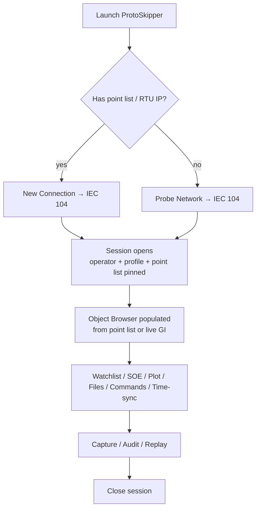

# IEC 60870-5-104 — UX, Feature, and Implementation Plan

> **Status:** Design document. Not yet code.
> **Scope:** ProtoSkipper Phase 4 (per `EXECUTION_PLAN.md`).
> **Mission:** Build the IEC 60870-5-104 client/server/test toolkit that
> SCADA/RTU engineers actually want to keep on their laptop —
> deliberately better than Triangle MicroWorks Test Harness, FreyrSCADA
> IEC 104 Master Simulator, Kalkitech SYNC 4104, ASE 2000 Communication
> Test Set, and QTester104.
> **Author:** ProtoSkipper maintainers (DataSailors).
>
> This document is the source of truth for the IEC 104 work.  Every
> dialog, every field, every message type, every test case is
> enumerated.  The implementation plan at the bottom slots into Phase 4
> of `EXECUTION_PLAN.md`.

---

## Table of contents

1. [Why we can win against the incumbents](#1-why-we-can-win-against-the-incumbents)
2. [Personas and primary journeys](#2-personas-and-primary-journeys)
3. [Feature catalog](#3-feature-catalog)
4. [Top-level UX flow](#4-top-level-ux-flow)
5. [Per-feature UX specification](#5-per-feature-ux-specification)
6. [Setup file format](#6-setup-file-format-iec104-setup-json)
7. [Beyond-the-basics ambitions](#7-beyond-the-basics-ambitions)
8. [Implementation task breakdown](#8-implementation-task-breakdown)
9. [Cross-cutting test strategy](#9-cross-cutting-test-strategy)
10. [Open questions and risks](#10-open-questions-and-risks)

---

## 1. Why we can win against the incumbents

Reference points (the five tools we benchmarked against):

* **Triangle MicroWorks Distributed Test Manager (DTM) / Test Harness 104** — the gold-standard commercial test harness; expensive per-seat license, Windows-only, dated UX.
* **FreyrSCADA IEC 104 Master/Slave Simulator** — affordable, but cluttered single-window UI with many quirks; Windows-only.
* **Kalkitech SYNC 4104 / Applied Systems Engineering ASE 2000** — strong protocol coverage, very expensive, Windows-only, slow start-up.
* **QTester104** (open source, by Ricardo Olsen) — free and useful but a one-window viewer; no automation, no fuzzing, no replay.
* **Wireshark with the 104asdu dissector** — best dissector on earth; not a tester, only a passive viewer.

Pain points and our response:

| Incumbent pain point | ProtoSkipper response |
|---|---|
| Windows-only | Cross-platform Linux/macOS/Windows on the same engine. |
| Per-seat license per engineer | GPL-3.0; runs on every laptop on the team. |
| Master OR slave OR analyzer in different products | One product is master, slave, analyzer, fuzzer, replayer. |
| No replay of captured `.pcapng` traffic | First-class replay window; writes disabled exactly like the Modbus replay we already ship. |
| "Test Set" GUI is a 1990s-style table of CSV-loaded points | Object browser tree, contextual right-click, watchlist, plot view. |
| Cannot fuzz a slave for negative testing | Built-in fuzzer with malformed APCI, illegal COT, oversize ASDU, time-jump. |
| No scripting | Python REPL with `iec104.session.send_command(123, on=True)`. |
| Conformance against IEC 60870-5-104 / IEC 60870-5-101 / Companion Standards (e.g. IEC 60870-5-104 §A telecontrol equipment) is informal | UCAIug-style conformance test profiles with PASS/FAIL report. |
| TLS (104s) support is uneven across vendors | First-class TLS 1.2/1.3 with mutual auth, tested against gnutls and OpenSSL endpoints. |
| Time-sync (C_CS_NA_1 type 103) handling is sloppy | Explicit time-sync widget with drift visualisation. |
| No multi-RTU bench overview | Bench panel showing 50 RTUs and per-RTU APDU roundtrip latency. |
| Audit log either absent or per-tool ad-hoc | HMAC-chained, append-only audit log per session (already shipped). |
| Closed-source quirks accumulate per-vendor | Open vendor profile library; community fixes. |

The bar for Phase 4 is therefore: every must-have from the incumbents,
plus everything in the table above, plus hold the line on the
ProtoSkipper invariants (audit, safety profiles, plugin contract,
core-no-Qt, Read/write split).

---

## 2. Personas and primary journeys

### 2.1 Personas

* **P1 — RTU commissioning engineer.** On site at a substation or pump
  station with a laptop and a switch.  Has the master station's point
  list as an Excel sheet.  Needs to: connect to the RTU, verify every
  point reports, end-to-end test the control points to a substation
  bay, sign off.
* **P2 — SCADA master engineer.** Office.  Wants to test that the
  master correctly handles edge cases (general interrogation, time
  sync, file transfer, late ACK).  Uses ProtoSkipper as a slave
  simulator.
* **P3 — Cyber/IT auditor.** Needs replayable PCAP, audit log, plus a
  TLS handshake inspector.
* **P4 — RTU vendor integration engineer.** Building an RTU.  Uses
  ProtoSkipper as a master, runs the conformance suite against their
  RTU before shipping.
* **P5 — Educator / researcher.** Teaches IEC 104 fundamentals;
  wants an interactive simulator with deterministic events.

### 2.2 Primary journeys

The product must make all five succeed without training, on day 1,
with the engineer's own point list.

1. **Connect-and-prove.** Open IP+port → `STARTDT` → general
   interrogation → see every point in the object browser → time
   budget 30 s.
2. **Single command.** Right-click breaker `Q1` → "Send select-execute"
   → safety dialog (in COMMISSIONING profile) → command sent →
   confirmation activation/termination shown → time budget 15 s.
3. **Interrogation health check.** "Run GI on every group + counter
   interrogation + time sync" with one button → per-RTU PASS/FAIL
   matrix.  Time budget 1 min.
4. **Replay last week's incident.** Drag-and-drop a `.pcapng` →
   filter by ASDU 30 (M_SP_TB_1) → see exactly when the SOE flood
   started.  Time budget 30 s.
5. **Stand in for an RTU.** "Substitute IED 7 with simulator" →
   point-list pulled from setup → ProtoSkipper answers GI as that RTU
   would.  Time budget 10 s.

If any of these takes longer than budgeted, we have a UX bug.

---

## 3. Feature catalog

### 3.1 Must-haves (every IEC 104 tool ships these)

* **F1.** Master client over TCP/2404 (and TLS/2405 — Edition 2 §11).
* **F2.** Slave server over TCP/2404 + TLS.
* **F3.** Full ASDU type set send + receive (see §3.4).
* **F4.** Cause-of-Transmission (COT) full set (1..47, plus Edition-2
  reserved).
* **F5.** APCI control: `STARTDT`, `STOPDT`, `TESTFR` act/con,
  `S-Format` (supervisory), `I-Format` (information).
* **F6.** k / w windowing (parameters per IEC 60870-5-104 §5.2).
* **F7.** t0/t1/t2/t3 timeout management (per §5.3).
* **F8.** General Interrogation (C_IC_NA_1 100), Counter Interrogation
  (C_CI_NA_1 101).
* **F9.** Clock-sync (C_CS_NA_1 103).
* **F10.** Single command, Double command, Step command, Set-point
  short / scaled / float (each in direct + select-execute variants).
* **F11.** File transfer (F_DR_TA_1 / F_FR_NA_1 / F_SR_NA_1 /
  F_SC_NA_1 / F_LS_NA_1 / F_AF_NA_1 / F_SG_NA_1 / F_DR_TA_1).
* **F12.** Audit log per session (already shipped).
* **F13.** Originator address (OA) and Common Address (CA) handling per
  Edition.
* **F14.** Sequence-of-Events (SOE) decoding with CP56Time2a, CP24Time2a,
  CP16Time2a parsing.

### 3.2 Differentiators (what beats the incumbents)

* **D1.** Master + Slave + Analyzer + Fuzzer + Replayer in one product.
* **D2.** Bench overview: every configured RTU, live status tile,
  RTT, last error.
* **D3.** Drag-and-drop PCAP analyzer with full IEC-104 dissection.
* **D4.** Slave simulator from CSV/Excel point list.
* **D5.** Fuzzer with documented APCI/ASDU mutations.
* **D6.** Vendor profile library: SEL, ABB, Siemens, Schneider, ZIV,
  Toshiba, GE, Hitachi, Sprecher, Wago, with their CA size, IOA size,
  COT-size quirks pre-filled.
* **D7.** TLS 1.3 mutual-auth path with handshake inspector.
* **D8.** Conformance test runner with profiles aligned to IEC
  60870-5-104:2006/A1:2016 plus EN 60870-5-104.
* **D9.** Scripting: every operation available from REPL and from
  `protoskipper run script.py`.
* **D10.** Diff between expected (CSV/Excel point list) and actual
  (live GI response): instant "what's different from spec".
* **D11.** Time-sync drift visualisation across RTUs.
* **D12.** Companion-standard awareness: IEC 60870-5-104 §A telecontrol;
  IEC 61850-80-1 (101→61850 gateway pattern); EN 50556 (toll roads);
  IEEE 1815/DNP3 cross-reference (informational).

### 3.3 Stretch (research / nice-to-have)

* **S1.** IEC 60870-5-101 over serial (RS-232/RS-485) using same data
  model — a logical sibling protocol; a single CSV point list works
  for both.
* **S2.** IEC 60870-5-103 (protection equipment informative interface)
  read-only viewer.
* **S3.** Companion standard IEC 60870-5-102 (electrical metering)
  read-only.
* **S4.** TASE.2 (ICCP) bridging for inter-control-centre testing.
* **S5.** Routable variant studies: 104 over UDP (non-standard) for
  research only.
* **S6.** Wireshark dissector handoff: export `.pcapng` with
  protoskipper-flavoured Custom Block annotations.
* **S7.** Multi-vendor interop matrix tracked publicly.

### 3.4 ASDU type catalogue (must be supported end-to-end)

Every type below: encode + decode + UI render + audit + replay.

**Process information in monitor direction (1..40)**
* 1 M_SP_NA_1 — Single-point information
* 2 M_SP_TA_1 — with CP24Time2a (legacy)
* 3 M_DP_NA_1 — Double-point information
* 4 M_DP_TA_1 — Double-point with CP24Time2a
* 5 M_ST_NA_1 — Step position
* 6 M_ST_TA_1 — Step position with CP24Time2a
* 7 M_BO_NA_1 — Bitstring of 32 bits
* 8 M_BO_TA_1 — Bitstring with CP24Time2a
* 9 M_ME_NA_1 — Measured value, normalised
* 10 M_ME_TA_1 — Normalised with CP24Time2a
* 11 M_ME_NB_1 — Measured value, scaled
* 12 M_ME_TB_1 — Scaled with CP24Time2a
* 13 M_ME_NC_1 — Measured value, short floating point
* 14 M_ME_TC_1 — Short float with CP24Time2a
* 15 M_IT_NA_1 — Integrated totals (counter)
* 16 M_IT_TA_1 — Integrated totals with CP24Time2a
* 17 M_EP_TA_1 — Event of protection equipment (legacy)
* 18 M_EP_TB_1 — Packed start events of protection
* 19 M_EP_TC_1 — Packed output circuit information
* 20 M_PS_NA_1 — Packed single-point with status change detection
* 21 M_ME_ND_1 — Measured value, normalised, no quality

**Process information with CP56Time2a (30..40) — IEC 104 mainstream**
* 30 M_SP_TB_1
* 31 M_DP_TB_1
* 32 M_ST_TB_1
* 33 M_BO_TB_1
* 34 M_ME_TD_1 — normalised with CP56Time2a
* 35 M_ME_TE_1 — scaled with CP56Time2a
* 36 M_ME_TF_1 — short float with CP56Time2a
* 37 M_IT_TB_1 — integrated totals with CP56Time2a
* 38 M_EP_TD_1
* 39 M_EP_TE_1
* 40 M_EP_TF_1

**Process information in control direction (45..51)**
* 45 C_SC_NA_1 — Single command
* 46 C_DC_NA_1 — Double command
* 47 C_RC_NA_1 — Regulating step command
* 48 C_SE_NA_1 — Set-point command, normalised
* 49 C_SE_NB_1 — Set-point command, scaled
* 50 C_SE_NC_1 — Set-point command, short float
* 51 C_BO_NA_1 — Bitstring of 32 bits

**Commands with CP56Time2a (58..64)**
* 58 C_SC_TA_1
* 59 C_DC_TA_1
* 60 C_RC_TA_1
* 61 C_SE_TA_1
* 62 C_SE_TB_1
* 63 C_SE_TC_1
* 64 C_BO_TA_1

**System information in monitor direction (70)**
* 70 M_EI_NA_1 — End of initialisation

**System information in control direction (100..107)**
* 100 C_IC_NA_1 — Interrogation command
* 101 C_CI_NA_1 — Counter interrogation
* 102 C_RD_NA_1 — Read command
* 103 C_CS_NA_1 — Clock synchronisation command
* 104 C_TS_NA_1 — Test command (legacy)
* 105 C_RP_NA_1 — Reset process command
* 106 C_CD_NA_1 — Delay acquisition command
* 107 C_TS_TA_1 — Test command with CP56Time2a

**Parameter (110..113)**
* 110 P_ME_NA_1 — Parameter of measured value, normalised
* 111 P_ME_NB_1 — Parameter of measured value, scaled
* 112 P_ME_NC_1 — Parameter of measured value, short float
* 113 P_AC_NA_1 — Parameter activation

**File transfer (120..127)**
* 120 F_FR_NA_1 — File ready
* 121 F_SR_NA_1 — Section ready
* 122 F_SC_NA_1 — Call directory, select file, call file, call section
* 123 F_LS_NA_1 — Last section, last segment
* 124 F_AF_NA_1 — Ack file, ack section
* 125 F_SG_NA_1 — Segment
* 126 F_DR_TA_1 — Directory
* 127 F_SC_NB_1 — QueryLog (Edition 2)

Custom and reserved types (135..255) supported in raw form for
private-range vendor extensions.

---

## 4. Top-level UX flow



Three side flows that do not need a live RTU:

```mermaid
flowchart LR
    P[Open PCAP file] --> Q[Replay viewer<br/>(APCI/ASDU dissection,<br/>writes disabled)]
    R[New IEC 104 Slave Simulator] --> S[Pick point list] --> T[Simulator running:<br/>answers GI, generates SOE]
    U[Run Conformance Suite] --> V[Pick target+profile] --> W[HTML/PDF report]
```

---

## 5. Per-feature UX specification

### Notation

* **Type:** `text` / `textarea` / `int` / `float` / `dropdown` /
  `radio` / `checkbox` / `file-picker` / `time-picker` / `multi-row` /
  `colour-picker` / `read-only`.
* **Required:** ✅ (mandatory) / ⚪️ (optional) / 🔒 (locked, derived).
* **Persisted in setup:** ✅ saved into `iec104-setup.json`; ❌ otherwise.

---

### 5.1 New Connection — IEC 104 Master

`File → New Connection… → Protocol = IEC 60870-5-104 (Master)`

| Field | Type | Required | Persisted | Notes |
|---|---|---|---|---|
| Connection name | text | ⚪️ (auto) | ✅ | ≤ 64 chars. |
| Host / IP | text | ✅ | ✅ | IPv4/IPv6/hostname. |
| Port | int | ✅ (default 2404) | ✅ | 1..65535. |
| Use TLS | checkbox | ⚪️ (default off) | ✅ | When on, default port becomes 19998 (per IEC 60870-5-7) but user can override. |
| TLS version | dropdown { 1.2, 1.3, auto } | ⚪️ (default auto) | ✅ | Visible only if TLS on. |
| Mutual auth | checkbox | ⚪️ | ✅ | Visible only if TLS on. |
| Client cert | file-picker | ⚪️ | ✅ (path) | PEM. |
| Client key | file-picker | ⚪️ | ❌ keychain | |
| Trust roots | file-picker (multi) | ⚪️ | ✅ | |
| Verify server cert | checkbox | ✅ (default true) | ✅ | Forced on in PRODUCTION. |
| Common Address (CA) | int | ✅ | ✅ | 1..65534 default 1; size selectable. |
| CA size (octets) | radio { 1, 2 } | ✅ (default 2) | ✅ | Per Edition / vendor profile. |
| IOA size (octets) | radio { 1, 2, 3 } | ✅ (default 3) | ✅ | |
| COT size (octets) | radio { 1, 2 } | ✅ (default 2) | ✅ | When 2, second octet = Originator Address (OA). |
| Originator Address (OA) | int | ⚪️ (default 0) | ✅ | Visible only when COT size = 2. |
| ASDU Address Field length | radio { default 2, 1 } | ✅ | ✅ | |
| Parameter k (max unACKed I-format) | int | ✅ (default 12) | ✅ | 1..32767. |
| Parameter w (latest ACK after w I-frames) | int | ✅ (default 8) | ✅ | 1..k. |
| Timeout t0 (s) | int | ✅ (default 30) | ✅ | Connection establishment. |
| Timeout t1 (s) | int | ✅ (default 15) | ✅ | Send / test APDU. |
| Timeout t2 (s) | int | ✅ (default 10) | ✅ | ACK no data messages (must be < t1). |
| Timeout t3 (s) | int | ✅ (default 20) | ✅ | TESTFR period during long idle. |
| Auto STARTDT after connect | checkbox | ✅ (default on) | ✅ | |
| Auto GI after STARTDT | checkbox | ✅ (default on) | ✅ | |
| Auto Counter Interrogation after GI | checkbox | ⚪️ (default on) | ✅ | |
| Auto Clock-sync after STARTDT | checkbox | ⚪️ (default on) | ✅ | |
| Reconnect on disconnect | checkbox | ⚪️ (default on) | ✅ | |
| Reconnect backoff (s) | int | ⚪️ (default 5) | ✅ | |
| Vendor profile preset | dropdown { generic, SEL, ABB, Siemens, Schneider, ZIV, Toshiba, GE, Hitachi, Sprecher, Wago, custom } | ✅ (default generic) | ✅ | Pre-fills CA/IOA/COT sizes and quirks. |
| Point list (CSV/XLSX) | file-picker | ⚪️ | ✅ (path) | If set, the session uses the list as the object model. |
| Edition | radio { 1.0 (Ed1), 2.0 (Ed2 with 2016 amendment), auto } | ✅ (default auto) | ✅ | |
| Profile (safety) | radio { LAB, COMMISSIONING, PRODUCTION } | ✅ | ✅ | Inherited. |
| Operator | text | ✅ | ✅ | |

**Sub-features inside the dialog:**
* **Test connection** — opens TCP, sends `STARTDT act`, expects
  `STARTDT con`; reports inline; closes.
* **Import from CSV/XLSX** — pre-fills CA from the list header (if
  present) and pins the point list.
* **Connection presets** — save/load like the IEC 61850 plan.

---

### 5.2 New Connection — IEC 104 Slave (Simulator)

`File → New IEC 104 Slave…`

| Field | Type | Required | Persisted |
|---|---|---|---|
| Bind interface | dropdown (auto-detected) | ✅ | ✅ |
| Bind address | text | ✅ (default 0.0.0.0) | ✅ |
| Port | int | ✅ (default 2404) | ✅ |
| Use TLS | checkbox | ⚪️ | ✅ |
| Server cert | file-picker | ⚪️ | ✅ |
| Server key | file-picker | ⚪️ | ❌ keychain |
| Require client cert | checkbox | ⚪️ | ✅ |
| Trust roots | file-picker (multi) | ⚪️ | ✅ |
| Common Address | int | ✅ | ✅ |
| CA / IOA / COT size | radios | ✅ | ✅ |
| Max concurrent masters | int | ✅ (default 4) | ✅ |
| Point list | file-picker | ✅ | ✅ (path) |
| Initial values source | radio { from point list, all-zeroes, random, script } | ✅ | ✅ |
| GI on receive | checkbox | ✅ (default on) | ✅ | If unchecked, simulator refuses GI to test master timeout handling. |
| Auto-respond to clock-sync | checkbox | ✅ (default on) | ✅ | |
| Spontaneous event source | radio { off, periodic, random, script, replay-from-PCAP } | ✅ (default off) | ✅ | |
| Spontaneous interval (ms) | int | ⚪️ | ✅ | |

In safety profile **PRODUCTION** the Slave Simulator is forbidden — you
should not impersonate an RTU on a production network.

---

### 5.3 Probe Network — IEC 104

| Field | Type | Required | Persisted | Notes |
|---|---|---|---|---|
| Network interface | dropdown | ✅ | ⚪️ | |
| CIDR / range | text | ⚪️ (default LAN) | ⚪️ | |
| Port | int | ✅ (default 2404) | ⚪️ | |
| Try TLS port too | checkbox | ⚪️ (default on) | ⚪️ | Adds 19998 / 2405. |
| TCP timeout (s) | float | ✅ (default 1.0) | ⚪️ | |
| Probe with STARTDT | checkbox | ✅ (default on) | ⚪️ | A real RTU answers STARTDT con. Without this, only TCP-open is verified. |
| CA range to try | text (CSV / range) | ⚪️ (default 1) | ⚪️ | e.g. `1-5,100`. |
| Stop-on-first-found | checkbox | ⚪️ | ⚪️ | |

Output table:
* IP, port, TLS yes/no, RTT, STARTDT con (yes/no), CA found, vendor
  guess (decoded from EI message ID if present), banner / Edition guess.

---

### 5.4 Object Browser — IEC 104 Data Model

The object browser tree is shaped by IOA hierarchy.  A vendor's point
list typically groups by 1000s; we honour that:

```
CA = 1
├── 1xxx  Single-points
│   ├── 1001  M_SP_TB_1   "CB Q1 Status"
│   └── 1002  M_DP_TB_1   "CB Q1 Pos"
├── 2xxx  Measurements
│   ├── 2001  M_ME_TF_1   "Bus voltage L1"
│   └── 2002  M_ME_TF_1   "Bus voltage L2"
├── 3xxx  Counters
└── 4xxx  Commands
```

Columns (toggleable):

| Col | Type | Notes |
|---|---|---|
| IOA | read-only | numeric |
| Type | read-only | "M_SP_TB_1 (30)" |
| FC dir | read-only | monitor / control |
| Label | text (editable from point list) | |
| Value | typed editor when writable | live |
| Quality | read-only badge | IV / NT / SB / BL / OV / EI |
| Timestamp | read-only | ms precision |
| Unit | read-only | from point list |
| COT last | read-only | last cause-of-transmission seen |
| Group | read-only | GI group 1..16 (per ASDU) or 0 (no GI) |
| Last update | read-only | wall clock |
| Source | read-only | "spontaneous" / "GI" / "command response" |

Right-click context menu per point:

* Read once (issues C_RD_NA_1 102 to that IOA)
* Add to watchlist
* Add to plot
* Send command… (only if type is in 45..64; gated by safety profile)
* Subscribe to changes (passive)
* Inject value (slave-mode only) — set the simulated value
* Show in PCAP analyzer
* Copy IOA

---

### 5.5 Watchlist + Plot

#### Watchlist
Same as the Modbus watchlist (already shipped).  Columns: IOA, label,
value, quality, timestamp, COT, polling on/off.

#### Plot
A yt plot of any selected measurement points.  X = wall clock or
session-relative.  Y = configurable per-trace scale (auto / fixed /
log).

* Add point: drag from object browser to the plot.
* Cursor: shows value at cursor for every trace.
* Time range: 30 s / 1 min / 5 min / 1 hour / since session start.
* Pause / Resume.
* Export: CSV, PNG.

---

### 5.6 SOE (Sequence of Events) panel

A streaming table of every received event (M_SP_TB_1, M_DP_TB_1,
M_ST_TB_1, M_ME_TD/TE/TF_1, M_IT_TB_1, M_EP_TD/TE/TF_1).

Columns: arrival time (laptop clock), CP56Time2a (RTU clock), drift
(arrival − rtu), CA, IOA, type, value, quality, COT.

Filters:
* Type filter (multi-select).
* COT filter (multi-select).
* IOA range.
* Time range.
* Quality flags (e.g. only show invalid).

Actions:
* Pause / Resume stream.
* Clear.
* Export to CSV / JSON / PCAP fragment.
* "Mark for report" — flagged rows go into the day's commissioning
  report.

---

### 5.7 Command panel

A purpose-built panel that surfaces every control-direction ASDU.

#### Command issue dialog

Opens from object browser → Send command…, or from this panel.

| Field | Type | Required | Persisted (template) |
|---|---|---|---|
| Target IOA | int | ✅ | ⚪️ |
| Type | dropdown { 45 C_SC, 46 C_DC, 47 C_RC, 48 C_SE-N, 49 C_SE-S, 50 C_SE-F, 51 C_BO, 58..64 timed variants } | ✅ | ✅ |
| Qualifier of Command (QU) | dropdown { 0 unspecified, 1 short pulse, 2 long pulse, 3 persistent, 4..31 reserved } | ✅ (default 0) | ✅ |
| Select / Execute | radio { Direct, Select-then-Execute } | ✅ | ✅ |
| Value (per type) | type-specific editor | ✅ | ✅ |
| Time tag (CP56Time2a) | time-picker / "now" / "explicit" | ✅ for type 58..64 | ✅ |
| OA (originator) | int | ⚪️ | ✅ |
| Wait for activation termination | checkbox | ✅ (default on) | ✅ |
| Activation timeout (s) | int | ✅ (default 10) | ✅ |
| Activation termination timeout (s) | int | ✅ (default 30) | ✅ |
| Re-confirm in PRODUCTION | locked text-back-the-tag | ✅ in PRODUCTION | ❌ |

#### Command outcome view

Per command shows the lifecycle:

```
[10:24:00.123] sent C_SC_NA_1 IOA=4001 select=true value=on
[10:24:00.456] received COT=7 (act-con) positive
[10:24:00.460] sent C_SC_NA_1 IOA=4001 execute=true value=on
[10:24:00.781] received COT=7 (act-con) positive
[10:24:01.234] received COT=10 (act-term) positive
[10:24:01.234] result: SUCCESS
```

Failure modes surfaced inline:
* Timeout on activation confirmation.
* Negative confirmation (P/N=1 or COT 44..47 unknown).
* RTU reports BAD quality on the IOA after execute.

Audit row pair (`write_authorization` + `write_committed` /
`write_failed`) lands per command, exactly as Modbus does today.

---

### 5.8 Interrogation panel

A dedicated panel for IEC 104 ceremony commands.

* **General Interrogation** — group dropdown (Global / 1..16). Issues
  C_IC_NA_1 (100); shows progress bar; shows "received N points";
  fails on timeout.
* **Counter Interrogation** — group dropdown (Global / 1..4) + freeze
  options (1=read, 2=count freeze, 3=count freeze with reset, 4=reset).
  Issues C_CI_NA_1 (101).
* **Read** — IOA picker → C_RD_NA_1 (102).
* **Test command** — Issues C_TS_NA_1 (104) or C_TS_TA_1 (107).
* **Reset Process** — Issues C_RP_NA_1 (105) — gated to LAB only by
  default.
* **Delay acquisition** — Issues C_CD_NA_1 (106).

Each ceremony writes both `write_authorization` and the outcome row to
the audit log; not skippable.

---

### 5.9 Time-sync panel

`Tools → IEC 104 → Time sync`

* **One-shot sync now** — writes C_CS_NA_1 (103) with current laptop
  time (or explicit timestamp).
* **Periodic sync** — interval (s) and which CA to sync.  Default off
  in PRODUCTION.
* **Drift visualisation** — line plot of (RTU CP56Time2a as it appears
  in incoming events) − (laptop wall clock) per IOA.  Helps spot
  RTUs that are 7 hours off because of misconfigured TZ.
* **Time quality flags** — table of every received CP56Time2a's IV /
  SU bits.  Highlights summer-time mistakes.

---

### 5.10 File transfer panel (F1xx ASDUs)

* Browse files known to the RTU (issues F_DR_TA_1 (126) Call Directory).
* Each file → Download (issues F_SC_NA_1 (122) call-file → receives
  F_FR_NA_1 (120), F_SR_NA_1 (121), F_SG_NA_1 (125), F_LS_NA_1 (123),
  acks via F_AF_NA_1 (124)).
* Upload (LAB / COMMISSIONING only).
* Verify (CRC if vendor exposes it).
* Save to disk; if the file is COMTRADE, opens the existing COMTRADE
  viewer (shared with IEC 61850).

---

### 5.11 Capture / Replay (D3)

`File → Open PCAP…` → opens the IEC 104 dissector view.

Tabs:
* **Frames** — sortable list with filter language `iec104.type ==
  M_SP_TB_1`, `iec104.cot == spontaneous`, `iec104.ioa == 4001`,
  `iec104.ca == 1`.
* **Sessions** — one row per TCP flow with k/w analysis (high-water
  mark of unacked I-frames, S-format counts, TESTFR exchanges).
* **APCI timeline** — visualises t1/t2/t3 violations as red bars.
* **Statistics** — APDU/s per type, per CA; SOE rate; command count;
  error count.

Replay mode disables every command button (per global P2 rule).

---

### 5.12 Bench overview (D2)

Loads all configured sessions from a setup, shows one tile per RTU:
name, IP, profile colour, online LED, RTT, last-seen value, count of
events in last minute, current k-window utilisation, last error.

Clicking a tile focuses that session.

---

### 5.13 Conformance test runner (D8)

`Tools → Conformance test → IEC 60870-5-104 → choose profile`

Profiles shipped:
* **Master Edition 2.0 + 2016/A1.**
* **Slave Edition 2.0 + 2016/A1.**
* **Master Edition 1.0 (legacy).**
* **Slave Edition 1.0.**
* **TLS-secured master/slave (per IEC 62351-3).**
* **GI conformance.**
* **Counter interrogation conformance.**
* **Clock-sync conformance.**
* **Command conformance (every type, both direct and select-execute).**
* **File transfer conformance.**
* **k/w window stress.**
* **t0/t1/t2/t3 timing conformance.**

Each profile = a YAML list of test cases.  Outcome = HTML / PDF / MD
report including the audit-log signature, target firmware (from
M_EI_NA_1 reason byte / vendor banner), date/time, operator.

---

### 5.14 Fuzzer (D5)

`Tools → IEC 104 → Fuzzer`

A controlled badness generator.  Always behind a "Fuzzing acknowledged"
checkbox; locked out of PRODUCTION profile.

Mutation categories (multi-select):

* **APCI mutations**:
  * Truncated frame (len < 4).
  * Oversize frame (len > 253).
  * Bad START byte (≠ 0x68).
  * I-frame with N(S) wrap-around mid-window.
  * S-frame with N(R) ahead of last sent N(S).
  * U-frame combining act+con bits illegally.
* **ASDU mutations**:
  * Type ID outside ranges.
  * Number of objects > frame length permits (overflow).
  * SQ=1 with VSQ=0 elements.
  * COT outside legal set for that type.
  * CA = 0 or CA = 65535 (broadcast / not-used).
  * IOA = 0.
  * Mismatched CA size vs configured size.
  * Time tag in 1899 / 2099.
  * CP56Time2a IV bit set + valid value.
* **Sequencing mutations**:
  * STARTDT con without STARTDT act.
  * STOPDT during active GI.
  * Two STARTDT con back to back.
* **TLS mutations** (when TLS on): renegotiate mid-stream;
  early-data; expired cert.

Outcome view per mutation: did the SUT crash, NACK, ignore, hang?
Each mutation and the SUT's behaviour goes into the audit log and
into the report.

---

### 5.15 Diff against point list (D10)

Loads a CSV/XLSX point list ("expected") and the live GI response from
the RTU ("actual").  Shows three columns: in expected only, in actual
only, in both.  For "in both", flags type / unit / quality mismatches
red.

One-click "Save diff to CSV" for handoff to the master station team.

---

### 5.16 Vendor profile library (D6)

`Preferences → IEC 104 → Vendor profiles`

Each profile is a YAML file shipped with the app:

```yaml
id: abb_rtu560
display_name: ABB RTU560
ca_size: 2
ioa_size: 3
cot_size: 2
default_oa: 0
asdu_address_field: 2
k: 12
w: 8
t0: 30
t1: 15
t2: 10
t3: 20
quirks:
  - "rtu560-ignores-counter-freeze-3"  # treats freeze=3 as freeze=2
  - "rtu560-emits-spontaneous-during-gi"
notes: |
  Tested against firmware 11.5.x.
```

Users can clone, edit, and contribute back.

---

### 5.17 Scripting bindings

REPL exposes:

* `iec104.MasterSession(host, port, ca, **opts)` with `connect()`,
  `gi(group=20)`, `ci(group=37, freeze=2)`, `command(ioa, type, ...)`,
  `set_clock(...)`, `read(ioa)`, `subscribe(callback)`.
* `iec104.SlaveServer(bind, port, ca, point_list, **opts)` with
  `start()`, `inject(ioa, value, quality, ts)`, `stop()`.
* `iec104.PcapReader(path)` for offline analysis.
* `iec104.Fuzzer(target, mutations=[...])`.

Every operation honours SafetyContext: in PRODUCTION the script must
hand a confirm callback or the dangerous calls deny.

---

## 6. Setup file format (`iec104-setup.json`)

```json
{
  "$schema": "https://protoskipper.io/schemas/iec104-setup-v1.json",
  "version": 1,
  "name": "FH-pump-RTU-commissioning",
  "created": "2026-05-03T10:24:00Z",
  "operator": "ayush@datasailors.io",
  "vendor_profile": "abb_rtu560",
  "point_list": {
    "path": "/path/to/iitjmu-fh-bp-pointlist.xlsx",
    "sheet": "Points",
    "checksum_sha256": "..."
  },
  "connection": {
    "host": "10.0.4.13",
    "port": 2404,
    "tls": { "enabled": false },
    "common_address": 1,
    "ca_size": 2,
    "ioa_size": 3,
    "cot_size": 2,
    "originator_address": 0,
    "params": { "k": 12, "w": 8, "t0": 30, "t1": 15, "t2": 10, "t3": 20 },
    "auto": { "startdt": true, "gi": true, "counter_int": true, "clock_sync": true },
    "reconnect": { "enabled": true, "backoff_s": 5 }
  },
  "watchlist": [
    { "ioa": 2001, "poll_ms": 1000 },
    { "ioa": 4001, "poll_ms": 0 }
  ],
  "plot": {
    "traces": [{ "ioa": 2001, "color": "#88CCEE" }],
    "range": "5min"
  },
  "soe": {
    "filters": { "types": [30, 31, 36], "cots": [3, 7, 11] }
  },
  "command_templates": [
    {
      "name": "Open Q1",
      "ioa": 4001, "type": 45, "qu": 1, "select_execute": true, "value": "off"
    }
  ],
  "time_sync": { "periodic_s": 0 },
  "audit": { "dir": "/var/log/protoskipper/2026-05-03/" },
  "bench_layout": { "tiles": [{ "id": "RTU01", "x": 0, "y": 0 }] }
}
```

Rules: same as the IEC 61850 plan — no secrets in the file (keychain
holds keys/passwords); paths absolute; setup file format versioned.

### Point list canonical schema (CSV / XLSX)

| Column | Required | Notes |
|---|---|---|
| `ioa` | ✅ | int |
| `type` | ✅ | "M_SP_TB_1" or 30 |
| `direction` | ✅ | "monitor" / "control" |
| `label` | ⚪️ | string |
| `unit` | ⚪️ | string |
| `scale` | ⚪️ | float |
| `offset` | ⚪️ | float |
| `gi_group` | ⚪️ | 1..16 |
| `cot_group` | ⚪️ | 1..4 (counter) |
| `description` | ⚪️ | string |
| `vendor_quirk` | ⚪️ | freeform tag |

We ship 3 sample lists from public utility specs.

---

## 7. Beyond-the-basics ambitions

Each becomes a Phase-4.x sub-task in §8.

* **B1.** **Cross-protocol point mirror.** Same point list drives both
  IEC 104 and IEC 101 (serial), so a mixed-link substation can be
  commissioned with one document.
* **B2.** **Pre-flight checklist mode.** Walks an engineer through a
  defined commissioning sequence: TCP open → STARTDT → GI → spot
  reads → command rehearsal (in LAB) → time sync → counter
  interrogation → file transfer → audit export.  PASS/FAIL ticks per
  step.
* **B3.** **"Find what's wrong" diagnostic.** Single button.  Detects:
  k-window over/underflow, t-timer violations, GI never completes,
  RTU clock drift > N s, COT-misuse, IOA appearing in events but not
  in the point list, IOA in the point list but not seen in GI.
* **B4.** **Bench replay.** Take yesterday's PCAP, replay it as a slave
  to test the master station's handling of yesterday's traffic
  patterns.
* **B5.** **Test set integration.** OMICRON CMC / Doble F6150 driven
  via TCP to inject current; ProtoSkipper asserts on the IEC-104
  events that should follow.  All in one audit.
* **B6.** **Multi-vendor interop matrix.** App-level table of "we
  connected to vendor X firmware Y on date Z: passed/failed" with
  links to artefacts.
* **B7.** **Field-laptop kiosk mode.** Same as IEC 61850 plan.
* **B8.** **"Compare against last commissioning"** — diff today's
  GI / SOE flow against last week's setup + audit log.
* **B9.** **101 ⇆ 104 gateway.**  ProtoSkipper as a serial-to-TCP
  gateway with audit.  Useful for legacy substations.
* **B10.** **Point list generator from SCD.**  Reads an IEC 61850 SCD,
  emits an IEC 104 point list per the IEC 61850-80-1 mapping
  guidelines.  Bridges teams.
* **B11.** **Public training mode** — built-in scenarios (CB stuck,
  RTU offline, time drift) drive the simulator on a deterministic
  schedule.
* **B12.** **Wireshark dissector handoff** — Lua dissector shipped in
  `extras/wireshark/`, dual-licensed MIT/GPL.

---

## 8. Implementation task breakdown

Tasks slot into Phase 4 of `EXECUTION_PLAN.md`.  Each follows the
existing schema (Goal / Files / Notes / AC / Tests required), sized
for one PR.

### P4.A — Plugin scaffold and codec

#### P4.A.1 Plugin package skeleton

* **Goal:** New pip-installable package
  `plugins-builtin/protoskipper-iec104/` registers
  `protocol_id = "iec104.tcp"` via the `protoskipper.protocols`
  entry-point group, loadable by `plugin_loader`.
* **Files:** `plugins-builtin/protoskipper-iec104/{pyproject.toml,
  src/protoskipper_iec104/{__init__.py,driver.py,apci.py,asdu.py,
  master.py,slave.py,fuzzer.py,pcap.py,pointlist.py,profiles/}}`.
* **AC:**
  * `pip install -e plugins-builtin/protoskipper-iec104/[dev]` works.
  * `protoskipper list-protocols` shows `iec104.tcp`.
  * `protoskipper-gui` does not crash with the plugin installed.
* **Tests required:** unit `test_plugin_loader.py::test_iec104_plugin_discovered`.

#### P4.A.2 APCI codec

* **Goal:** Pure-Python encode/decode of all three APCI formats
  (I, S, U) with k/w accounting state machine; protocol-spec test
  vectors.
* **Files:** `protoskipper_iec104/apci.py`,
  `tests/unit/test_iec104_apci.py`.
* **AC:**
  * Encode I-frame with N(S)=N(R)=0 produces wire bytes equal to
    a captured reference.
  * Decode of every S/U/I example from IEC 60870-5-104 §5.1 round-trips.
  * State machine raises on unknown U-frame combinations.
* **Tests required:** ≥ 30 vector cases.

#### P4.A.3 ASDU codec — every type listed in §3.4

* **Goal:** Encode + decode every type in §3.4 incl. CP56Time2a /
  CP24Time2a / CP16Time2a, scaled / normalised / float values, every
  Quality Descriptor (QDS, QDP, QPM, QOI, QCC, QRP, QOS, QOC, QPA,
  SCO, DCO, RCO).
* **Files:** `protoskipper_iec104/asdu.py`,
  `tests/unit/test_iec104_asdu.py`.
* **AC:**
  * Round-trip for every type and every quality variant.
  * Endian / VSQ / SQ / Number-of-objects encoding correct against
    Wireshark-captured reference frames.
  * Time encoding correct around DST transitions, leap seconds, and
    year wraps.
* **Tests required:** ≥ 100 vector cases (≥ 1 per type, ≥ 4 per timed
  variant including IV / SU / RES bits).

#### P4.A.4 Point list parser (CSV + XLSX)

* **Goal:** `pointlist.load(path)` returns typed objects matching the
  schema in §6.
* **AC:**
  * Loads sample lists shipped under
    `examples/iec104-pointlists/*.{csv,xlsx}`.
  * Errors point at row+column.
  * `mypy` clean; coverage ≥ 95 %.

---

### P4.B — Master client

#### P4.B.1 TCP connect + STARTDT/STOPDT

* **Goal:** `MasterSession.connect()` opens TCP, sends `STARTDT act`,
  awaits `STARTDT con` within t1, raises on timeout.
* **AC:**
  * Against the in-tree Slave (P4.D), full handshake works.
  * Wrong port / connection refused → typed error.
  * STARTDT con never arrives → `IEC104TimeoutError`, audit row
    written.

#### P4.B.2 k/w windowing + S-frame management

* **Goal:** I-frame send is throttled at k unacked; w receives trigger
  S-frame ACK.
* **AC:**
  * Sending `k+1` I-frames blocks until an S-frame from the peer
    advances the window.
  * After w received I-frames the master sends an S-frame within
    t2.

#### P4.B.3 t1/t2/t3 timer machine

* **Goal:** All four timers per IEC 60870-5-104 §5.3 implemented.
* **AC:**
  * Idle for t3 triggers TESTFR act; missing TESTFR con within t1
    closes the session.
  * Verified by integration tests with a stubbed peer that withholds
    ACKs.

#### P4.B.4 General + Counter Interrogation

* **Goal:** `gi(group)` and `ci(group, freeze)` issue the right
  C_IC/C_CI, collect every responding ASDU, terminate on COT=10
  (act-term).
* **AC:**
  * Empty point list → finishes within t1 with zero objects.
  * Slave that stops responding mid-GI → master raises
    `IEC104InterrogationTimeout` with partial result.
  * GI returning 5 000 points completes in < 5 s on localhost.

#### P4.B.5 Read command

* **Goal:** `read(ioa)` issues C_RD_NA_1 102 and waits for the
  matching response.

#### P4.B.6 Single / Double / Step / Set-point / Bitstring commands

* **Goal:** `command(ioa, type, value, *, select=True, qu=0)` covers
  types 45..51 and timed variants 58..64; honours select-then-execute
  state machine.
* **AC:**
  * Direct command produces 1 act request → expects 1 act-con,
    optional act-term.
  * Select-then-execute produces 2 act requests; second waits on
    first's act-con.
  * All commands write `write_authorization` + `write_committed` /
    `write_failed` to the audit log.

#### P4.B.7 Clock sync (C_CS_NA_1 103)

#### P4.B.8 File transfer (F-* ASDUs)

* **Goal:** Browse → download → verify → save.
* **AC:** A 1 MB file transfers in < 30 s on localhost without missed
  segments.  Mid-transfer disconnect produces a partial file flagged
  as such.

#### P4.B.9 Reconnect on disconnect

#### P4.B.10 TLS (per IEC 62351-3)

* **Goal:** TLS 1.2/1.3 mutual auth path; cipher suite policy locked
  to a documented set.
* **AC:**
  * Handshake against a gnutls test server succeeds.
  * Unsupported cipher suite → typed error referencing the negotiated
    suite.

---

### P4.C — Slave server

#### P4.C.1 TCP listener + STARTDT / STOPDT handling

#### P4.C.2 Point-list-driven data model

* **Goal:** `SlaveServer(point_list)` answers GI by walking the list.

#### P4.C.3 Spontaneous event generator

* **Goal:** Periodic / random / scripted / replay-driven event source.
* **AC:**
  * Periodic 100 ms generator emits 10 events/s for 60 s with no
    drops.
  * Replay from a loaded PCAP reproduces the original ASDU
    inter-arrival times within ± 5 ms p95.

#### P4.C.4 Command receive + ack lifecycle

* **AC:**
  * Direct C_SC → emits act-con, optional act-term.
  * SBO C_SC → emits act-con on select, act-con on execute,
    act-term.

#### P4.C.5 Counter interrogation, clock sync, file services on slave

#### P4.C.6 TLS server-side

---

### P4.D — Fuzzer

#### P4.D.1 APCI mutation engine
#### P4.D.2 ASDU mutation engine
#### P4.D.3 Sequencing mutation engine
#### P4.D.4 TLS mutation engine
#### P4.D.5 GUI panel + report

* **AC:**
  * Each documented mutation produces the documented wire behaviour,
    verified by a captured PCAP.
  * Disabled outside LAB profile.
  * Report includes the audit-log signature and per-mutation outcome.

---

### P4.E — PCAP analyzer

#### P4.E.1 Pcapng reader extension for IEC 104

* **Goal:** Reuse the existing `core/capture/pcapng.py` (P2.A.1) +
  IEC 104 dissector.

#### P4.E.2 Filter language

* **AC:** `iec104.type == M_SP_TB_1`, `iec104.cot == spontaneous`,
  `iec104.ioa == 4001`, `iec104.ca == 1`, `tcp.flow == 3`,
  conjunctions / disjunctions / regex.

#### P4.E.3 APCI timeline / k-w analysis / statistics views

---

### P4.F — GUI panels

#### P4.F.1 New Connection (master) dialog
#### P4.F.2 New Slave Simulator dialog
#### P4.F.3 Probe Network for IEC 104
#### P4.F.4 Object browser shaped per §5.4
#### P4.F.5 Watchlist + plot
#### P4.F.6 SOE panel
#### P4.F.7 Command panel + command issue dialog
#### P4.F.8 Interrogation panel
#### P4.F.9 Time-sync panel + drift visualiser
#### P4.F.10 File transfer panel
#### P4.F.11 PCAP analyzer view
#### P4.F.12 Bench overview
#### P4.F.13 Conformance test runner UI
#### P4.F.14 Diff-against-point-list panel
#### P4.F.15 Vendor profile library editor

---

### P4.G — Cross-cutting

#### P4.G.1 Audit-log row schema for IEC 104

* **Goal:** Every IEC 104 action lands an audit row with the same
  shape as Modbus, plus an `iec104.subevent` discriminator
  (`startdt`, `stopdt`, `gi`, `ci`, `read`, `command`,
  `command_select`, `command_execute`, `command_term`, `clock_sync`,
  `file_call`, `file_segment`, `fuzzer_mutation`, `slave_event`).
* **AC:** `verify_log` clean for a 60-minute mixed session.

#### P4.G.2 Setup save/load (`iec104-setup.json`)
#### P4.G.3 Scripting bindings
#### P4.G.4 Conformance profile schema + first 4 profiles
#### P4.G.5 Vendor profile schema + 11 shipped profiles
#### P4.G.6 Documentation (`docs/IEC104.md` + manual tests)

---

## 9. Cross-cutting test strategy

### 9.1 Per task

Every task above arrives with:

1. Unit test exercising pure logic.
2. Integration test against the in-tree slave or against `lib60870-C`
   reference implementations (chosen for permissive licensing).
3. GUI test (when the task touches the GUI).
4. ≥ 1 negative-path test.
5. Manual-test script under `docs/manual-tests/m_iec104_*.md`.

### 9.2 Edge cases mandatory across the whole feature

* **CA size mismatch** — slave configured for 2-octet, master sends
  1-octet ASDU.  Both sides surface a precise error, no crash.
* **IOA size mismatch** — same thing, three flavours.
* **COT size 1 vs 2** — second-octet OA presence handled in both
  directions.
* **VSQ SQ-bit + IOA arithmetic** — SQ=1 means consecutive IOAs
  starting from the first.  Decoder must produce N objects, not 1.
* **TI / CASDU / IOA = 0** — reserved and must be rejected.
* **CP56Time2a IV bit** — must propagate to Quality.
* **CP56Time2a in 1899 / 2099** — must round-trip; UI flags the user.
* **Time during DST jump** — sync at 02:30 in spring-forward locale;
  all timestamps remain monotonic in UTC view.
* **k-window underflow** — peer ACKs more than we sent → close the
  connection with diagnostic.
* **k-window overflow** — peer never ACKs → t1 fires, connection
  closed cleanly.
* **STARTDT after STARTDT** — second one ACKed but no state change.
* **STOPDT during GI** — abort GI, surface partial result.
* **TESTFR ping-pong storm** — both peers asking; engine must not
  ladder to deadlock.
* **TLS renegotiation mid-stream** — supported in 1.2; refused in 1.3
  per the spec.
* **Duplicate IOAs in point list** — detected at load; second
  occurrence flagged.
* **Spontaneous event during GI** — spec allows; UI must not
  drop / mis-attribute.
* **Concurrent masters on one slave (when slave is the simulator)** —
  k/w accounting is per session.
* **Large GI (50 000 points)** — must succeed within 60 s on LAN.
* **Slow link (200 ms RTT)** — k=1 still yields throughput
  proportional to RTT; UI does not lock up.
* **Pcap with truncated last packet** — decoder reports partial,
  does not crash.

### 9.3 Visual / flow pass criteria

For every panel:

* Initial empty state has a one-line explanation and a one-button CTA.
* All actions reachable by keyboard alone.
* Timestamps to ms precision; tooltip shows µs / ns / time-quality.
* Dark-mode parity tested.
* Compact-density mode keeps every column readable on a 13" laptop.
* Ctrl+F search / filter consistent across panels.
* Long-running operations (GI, file transfer) must show a cancel
  button that actually cancels within 1 s.

### 9.4 Performance targets

* Connect + STARTDT con + GI of 1 000 points: ≤ 1 s on LAN.
* SOE rate sustained: 1 000 events/s for 10 minutes with no UI
  freeze.
* Plot view: 8 traces at 1 sample / 100 ms render ≥ 30 fps.
* PCAP load: 100 MB in ≤ 5 s.
* Bench overview: 100 RTU tiles update within 200 ms after one event.
* Slave simulator: answer GI of 5 000 points in ≤ 1.5 s.

### 9.5 Soak targets

* 24-hour mixed session (1 master, 4 slaves on the same machine,
  100 ms event cadence): zero crashes, RSS growth < 100 MB, audit log
  verifies clean.
* 1 000 reconnects in 1 hour: no leaked threads, no leaked sockets, no
  audit-log gaps.

### 9.6 Conformance vectors

We ship a vector library of canonical PCAPs:

* `pcap/iec104-startdt-handshake.pcapng`
* `pcap/iec104-gi-1000-points.pcapng`
* `pcap/iec104-counter-interrogation.pcapng`
* `pcap/iec104-clock-sync.pcapng`
* `pcap/iec104-command-direct.pcapng`
* `pcap/iec104-command-sbo.pcapng`
* `pcap/iec104-file-transfer.pcapng`
* `pcap/iec104-tls.pcapng`
* `pcap/iec104-malformed-overlong.pcapng`
* `pcap/iec104-malformed-bad-cot.pcapng`
* `pcap/iec104-k-window-stress.pcapng`

Each vector is the input fixture for ≥ 1 dissector test and ≥ 1
GUI test.

---

## 10. Open questions and risks

* **TLS port choice.**  Spec says 19998 historically; some vendors
  use 2405; some keep 2404 with STARTTLS-style upgrade.  We support
  all three; we document the matrix.
* **Vendor quirks.**  Real-world fleets accumulate quirks faster than
  we can ship profiles.  Solution: open the vendor profile library to
  contributions and treat it as live.
* **Edition negotiation.**  The protocol has no explicit version
  exchange; our auto detection relies on M_EI_NA_1 reason byte and
  observation of supported types.  Document the heuristic.
* **PCAP completeness.**  Capture on Windows requires Npcap; on macOS
  requires the `chmod` trick on `/dev/bpf*`.  Ship clear setup docs.
* **Fuzzer responsibility.**  Fuzzer outputs malformed traffic.  Ship
  with safety profile gating, "Acknowledged" checkbox, and forbid
  fuzzing against any host outside an explicit allow-list.
* **101 over serial (S1).**  Adds a serial-port build matrix
  (pyserial); ship as a separate optional plugin so the 104 plugin
  stays portable.
* **Companion standard licensing (IEC 60870 family).**  We do not
  ship spec text; we ship descriptive paraphrase + standards-citation
  pointers.  Same approach as IEC 61850 plan.
* **TASE.2 / ICCP (S4).**  Long-tail; ship only when at least one
  user demands it.

---

*End of plan.  Anything proposed for the IEC 104 feature set that
isn't in this document is not on the road to a 1.0 IEC 104 release.
Add it explicitly here, with a numbered task and tests, or it does
not happen.*
