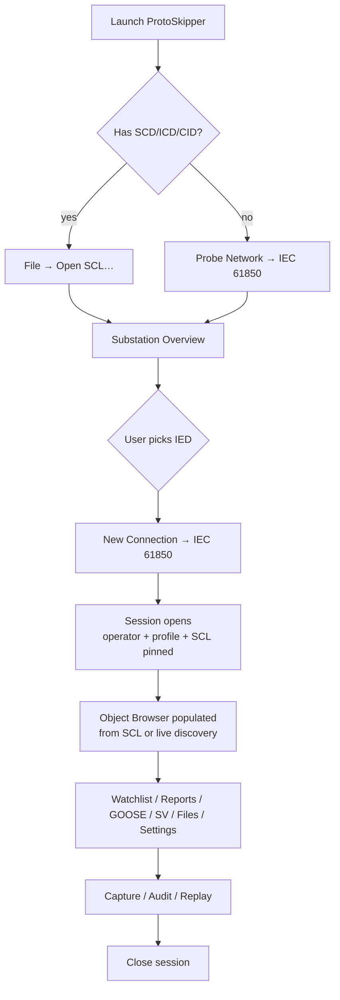

# IEC 61850 — UX, Feature, and Implementation Plan

> **Status:** Design document. Not yet code.
> **Scope:** ProtoSkipper Phase 8 (per `docs/internal/EXECUTION_PLAN.md`).
> **Mission:** Build the IEC 61850 client/test/commissioning toolkit that
> substation engineers actually want to keep on their laptop —
> deliberately better than OMICRON IEDScout, kema's UniCA, Triangle MicroWorks
> 61850 Test Suite, and ASE's IEC 61850 Tester.
> **Author:** ProtoSkipper maintainers (DataSailors).
>
> This document is the source of truth for the IEC 61850 work.  It is
> deliberately exhaustive: every dialog, every field, every save format,
> every test case.  The implementation plan at the bottom turns this
> into individually-verifiable tasks numbered to slot into Phase 8.

---

## Table of contents

1. [Why we can win against IEDScout](#1-why-we-can-win-against-iedscout)
2. [Personas and primary journeys](#2-personas-and-primary-journeys)
3. [Feature catalog](#3-feature-catalog)
4. [Top-level UX flow](#4-top-level-ux-flow)
5. [Per-feature UX specification](#5-per-feature-ux-specification)
6. [Setup file format](#6-setup-file-format-iec61850-setup-json)
7. [Beyond-the-basics ambitions](#7-beyond-the-basics-ambitions)
8. [Implementation task breakdown](#8-implementation-task-breakdown)
9. [Cross-cutting test strategy](#9-cross-cutting-test-strategy)
10. [Open questions and risks](#10-open-questions-and-risks)

---

## 1. Why we can win against IEDScout

IEDScout is the de-facto reference for ad-hoc IEC 61850 testing.  It is
also a closed-source, license-locked Windows-only tool with a UX
designed in 2008.  Every gap below is something a working substation
engineer has complained about in public forums or in the OMICRON
support log.

| IEDScout pain point | ProtoSkipper response |
|---|---|
| Windows-only | Cross-platform (Linux primary, macOS, Windows) on the same engine. |
| Per-seat license per engineer | GPL-3.0; runs on every laptop on the team. |
| No GOOSE *publisher* (subscriber only) | First-class GOOSE publisher with packet-shaped editor. |
| No SV publisher/subscriber out of the box | Native SV pub+sub, scope view, FFT, harmonics. |
| Reads SCL only at session start | Live SCL diff: edit a CID, hot-reload into the running session. |
| Reports view is a flat table | Report timeline, replayable, filterable by RCB/dataset/severity. |
| Setting groups limited | Full setting-group editor with diff against ICD baseline. |
| No file-transfer browser | Browse + download IED files (DR, COMTRADE, fault records) over MMS. |
| No COMTRADE viewer | Built-in COMTRADE/CFG/DAT viewer with overlay against live SV. |
| No simulator | Built-in IED simulator from any ICD/CID. |
| No conformance testing | UCAIug-aligned conformance test profiles per Edition (1, 2, 2.1). |
| No PCAP analysis | Open any PCAP and dissect GOOSE/SV/MMS without a live network. |
| No multi-IED bench overview | Substation overview panel showing all IEDs, online state, GOOSE health. |
| Closed-source GOOSE encoding bugs (e.g. fixed-offset bug in v6) | Open spec-compliance test vectors; community fixes. |
| Commissioning audit limited to local export | HMAC-chained, append-only audit log per session (already shipped). |
| No scripting | Embedded Python REPL with `iec61850.session.read("LD0/MMXU1.AnIn1.mag.f")`. |

The bar is therefore: **the eight things IEDScout does well**, plus **fix
every gap in the table above**, plus **hold the line on the
ProtoSkipper invariants** (audit, safety profiles, plugin contract,
core-no-Qt).

---

## 2. Personas and primary journeys

### 2.1 Personas

* **P1 — Field commissioning engineer.** Visits a substation with a
  laptop and an Ethernet switch.  Has the SCD file emailed by the
  utility.  Needs to: connect to every IED, verify the published GOOSE
  matches the SCD, simulate the missing IEDs, sign off the day.
* **P2 — Protection design engineer.** Office-bound.  Builds and
  validates SCL files.  Needs offline analysis, simulation, and
  conformance reports against a vendor's claimed Edition.
* **P3 — IT/Cybersecurity auditor.** Needs replayable PCAP, audit log,
  and documentation that says exactly what was sent on the wire.
* **P4 — Vendor integration test engineer.** Building an IED.  Needs a
  reference client to verify their server, plus malformed-frame
  injection ("fuzz this CID's reporting").
* **P5 — Researcher / educator.** Demonstrates 61850 to students.
  Needs an interactive simulator with deterministic events.

### 2.2 Primary journeys

The product must make all five of the following succeed without
training, on day 1, with the engineer's own SCD file.

1. **Browse-and-prove.** Open SCD → connect to every IED → verify each
   IED reports the data the SCD says it does.  *Time budget:* 5 min.
2. **GOOSE health check.** Subscribe to all configured GOOSE
   datasets in the SCD; flag missing publishers, stale frames, allData
   mismatches.  *Time budget:* 1 min.
3. **Test-mode write.** Force `Mod.stVal = test/blocked` on a switch
   bay safely, with the audit log proving which engineer did so.
   *Time budget:* 30 s including the safety dialog.
4. **Disturbance record retrieval.** Browse the file system of a faulted
   IED, download the COMTRADE files, view them locally with overlay
   against the SV stream captured at the same time.  *Time budget:*
   2 min from "we had a fault" to "the records are on my disk".
5. **Substitute IED.** "The bay is missing IED 3; simulate it from the
   SCD".  *Time budget:* 10 s to start a simulator with the right
   GOOSE-publish behaviour.

If any of these five takes more time than budgeted, we have a UX bug.

---

## 3. Feature catalog

### 3.1 Must-haves (no IEC 61850 tool ships without these)

* **F1.** SCL file load + parse + validation (Editions 1.0, 2.0, 2.1, 2.2).
* **F2.** MMS client: connect, browse data model, read/write data
  attributes, control with all four security models
  (direct-with-normal-security, direct-with-enhanced-security,
  select-before-operate-with-normal, SBO-enhanced).
* **F3.** Reporting: subscribe to BRCB/URCB, see reports as they arrive,
  acknowledge / reset / disable.
* **F4.** Logging: read the IED's log buffer.
* **F5.** Setting groups: read and edit setting-group values per group
  number.
* **F6.** GOOSE subscriber: subscribe to a published GOOSE control block,
  decode allData, raise on stNum / sqNum issues.
* **F7.** Sampled Values subscriber: scope view of a published SV stream
  (typ. 80 samples/cycle protection or 256/cycle measurement).
* **F8.** Time-sync awareness: detect SNTP / PTP source, surface drift.
* **F9.** Data sets: list, add, remove, modify.
* **F10.** File services: list/read/write/delete files on the IED.
* **F11.** Audit log per session, HMAC-chained (already shipped at the
  core layer).

### 3.2 Differentiators (what beats IEDScout)

* **D1.** GOOSE publisher with a frame-shaped editor.
* **D2.** SV publisher (configurable rate, harmonics, transient injection).
* **D3.** Substation overview: every IED in the SCD, live status tile.
* **D4.** SCL diff (visual side-by-side, semantic — not text diff).
* **D5.** SCL editor (limited — enough to edit DataSets, RCBs, GoCBs,
  inputs/extRefs without leaving ProtoSkipper).
* **D6.** COMTRADE viewer + overlay with live SV.
* **D7.** PCAP open mode: drag-and-drop a `.pcapng`, see GOOSE/SV/MMS
  dissected, no network required.
* **D8.** IED simulator: pick an ICD/CID, run as a virtual IED,
  publish its configured GOOSE/SV, answer MMS reads, drive its
  reporting from a script.
* **D9.** Conformance test runner: UCAIug-aligned profiles per edition.
* **D10.** Disturbance record retrieval workflow (DR list → download →
  view).
* **D11.** Multi-IED parallel commissioning: open 8 IEDs at once on
  separate threads, see them all in one view.
* **D12.** Scripting: every operation available from the REPL and from
  `protoskipper run script.py`.

### 3.3 Stretch (research / nice-to-have)

* **S1.** R-GOOSE / R-SV (61850-90-5) routable variants.
* **S2.** 61850-9-3 / IEEE C37.238 PTP power profile awareness.
* **S3.** 61850-7-410 hydropower extensions (data model presets).
* **S4.** 61850-7-420 DER extensions (data model presets).
* **S5.** 61850-8-2 XMPP transport (research only — not deployed in
  production today, but the spec exists).
* **S6.** Wireshark dissector handoff: export a `.pcapng` with
  protoskipper-flavoured Custom Block annotations that Wireshark can
  display via a companion Lua dissector.
* **S7.** Time-quality stress test: deliberately skew `t` in a GOOSE
  message to see whether the subscriber is 7-2 §6.2.4-compliant.
* **S8.** Multi-vendor interoperability matrix: an in-app table of
  "we connected to vendor X firmware Y on YYYY-MM-DD: passed/failed".

---

## 4. Top-level UX flow



Two side flows that do not need a session:

```mermaid
flowchart LR
    P[Open PCAP file] --> Q[Replay viewer<br/>(GOOSE/SV/MMS dissection,<br/>writes disabled)]
    R[New IED Simulator] --> S[Pick ICD/CID] --> T[Simulator running:<br/>publishes GOOSE/SV,<br/>answers MMS]
```

---

## 5. Per-feature UX specification

### Notation used in the field tables

* **Type:** `text` (single line), `textarea`, `int`, `float`, `dropdown`,
  `radio`, `checkbox`, `file-picker`, `time-picker`, `multi-row`
  (repeatable group of fields), `colour-picker`, `read-only`.
* **Required:** ✅ (mandatory) / ⚪️ (optional) / 🔒 (locked, derived).
* **Persisted in setup:** ✅ if the field is saved into the
  `iec61850-setup.json` file; ⚪️ otherwise.

---

### 5.1 New Connection — IEC 61850

Reached from `File → New Connection… → Protocol = IEC 61850 (MMS)`.

| Field | Type | Required | Persisted | Notes / validation |
|---|---|---|---|---|
| Connection name | text | ⚪️ (auto from IED name) | ✅ | Free text, ≤ 64 chars. |
| Host / IP | text | ✅ | ✅ | IPv4, IPv6, or hostname. |
| Port | int | ✅ (default 102) | ✅ | 1..65535. |
| Source AP-Title (calling) | text | ⚪️ | ✅ | OID; default "1,3,9999,33". |
| Source AE-Qualifier | int | ⚪️ | ✅ | default 33. |
| Destination AP-Title (called) | text | ⚪️ | ✅ | Read from CID `Address` if provided. |
| Destination AE-Qualifier | int | ⚪️ | ✅ | Read from CID. |
| Local TSEL | text (hex) | ⚪️ | ✅ | Default `00 01`. |
| Remote TSEL | text (hex) | ⚪️ | ✅ | Default `00 01`. |
| Local SSEL | text (hex) | ⚪️ | ✅ | Default `00 01`. |
| Remote SSEL | text (hex) | ⚪️ | ✅ | Default `00 01`. |
| Local PSEL | text (hex) | ⚪️ | ✅ | Default `00 00 00 01`. |
| Remote PSEL | text (hex) | ⚪️ | ✅ | Default `00 00 00 01`. |
| Authentication | dropdown { none, password, certificate } | ✅ (default none) | ✅ | Cert path & key path appear when certificate. |
| Password | text (masked) | ⚪️ | ❌ stored only in OS keychain | Only when authentication=password. |
| Client cert path | file-picker | ⚪️ | ✅ (path only) | Only when authentication=certificate. |
| Client cert key | file-picker | ⚪️ | ❌ keychain | Only when authentication=certificate. |
| Trust roots | file-picker (multi) | ⚪️ | ✅ (paths) | PEM bundle. |
| Verify server cert | checkbox | ⚪️ (default true) | ✅ | Off forbidden in PRODUCTION profile. |
| Read timeout (s) | int | ✅ (default 5) | ✅ | 1..60. |
| Connect timeout (s) | int | ✅ (default 10) | ✅ | 1..60. |
| MMS keep-alive (s) | int | ⚪️ (default 30) | ✅ | 0 disables. |
| Max PDU size | int | ⚪️ (default 65000) | ✅ | 256..65000. |
| SCL pin (file) | file-picker | ⚪️ | ✅ (path) | If set, the session uses the SCL data model rather than live discovery. |
| Pin SCL IED name | dropdown (populated from SCL) | ⚪️ | ✅ | Required when SCL pin is set. |
| Edition | radio { 1.0, 2.0, 2.1, auto } | ✅ (default auto) | ✅ | Drives expected behaviour for negotiation. |
| Profile (safety) | radio { LAB, COMMISSIONING, PRODUCTION } | ✅ | ✅ | Inherited from ProtoSkipper; documented separately. |
| Operator | text | ✅ | ✅ | Pre-filled from preferences. |

**Sub-features inside the dialog:**
* **Test connection** button — runs `Initiate-Request` only, reports
  result inline without committing the session.
* **Import from SCL** button — fills every field above from a chosen
  IED inside an SCL file (one click sets host, port, TSEL, AP-Title,
  edition).
* **Connection presets** — "Save as preset" stores the whole setup
  under a name; presets are dropdown-pickable on next launch.

---

### 5.2 Probe Network — IEC 61850

| Field | Type | Required | Persisted | Notes |
|---|---|---|---|---|
| Network interface | dropdown (auto-detected) | ✅ | ⚪️ | Probes pick layer-2 if needed. |
| CIDR / range | text | ⚪️ (default LAN) | ⚪️ | e.g. 10.0.0.0/24. |
| Port (MMS) | int | ✅ (default 102) | ⚪️ | |
| Probe by | checkbox group { TCP/102 sweep, GOOSE listener, GOOSE+SV listener, SCL-driven } | ✅ | ⚪️ | Multi-select. SCL-driven uses an open SCL to enumerate expected IEDs. |
| Listen duration for GOOSE/SV | int s | ✅ (default 10) | ⚪️ | 1..120. |
| Stop-on-first-found | checkbox | ⚪️ (default off) | ⚪️ | |
| VLAN scope | text (CSV of VIDs) | ⚪️ | ⚪️ | Default: any VLAN seen on the wire. |

Output table columns:

* IED name (from SCL match) / "unknown" if no SCL pinned.
* IP address.
* MAC.
* Vendor (decoded from OUI).
* GOOSE GoCBRef list seen (multi-line).
* SV svID list seen (multi-line).
* Edition (negotiated).
* Latency (RTT to MMS port-102 SYN).
* "Use selected for connection…" → opens `New Connection → IEC 61850`
  pre-filled.

---

### 5.3 Object Browser — IEC 61850 Data Model

The object browser tree is shaped exactly like the data model:

```
LDName  (LDevice)
├── LN-class[<inst>]   (e.g. MMXU1, XCBR1, LLN0)
│   ├── DataObject  (e.g. Pos, Mod, A)
│   │   ├── DataAttribute  (e.g. stVal, q, t, ctlVal)
│   │   │   ├── BasicValue  (q.value)
│   │   │   └── …
```

Columns (each toggleable, like Modbus object browser):

| Col | Type | Notes |
|---|---|---|
| Path | read-only | full FCDA: `LD0/MMXU1.Mod.stVal` |
| FC | read-only | functional constraint (ST, MX, CO, SG, …) |
| CDC | read-only | common data class (e.g. INS, ACT, MV) |
| Type | read-only | basic type (BOOLEAN, INT32, …) |
| Value | typed editor when writable | live |
| Quality | read-only badge | good / invalid / questionable / overflow / outOfRange / badReference / oscillatory / failure / oldData / inconsistent / inaccurate / source = test / source = substituted |
| Timestamp | read-only | ms precision; tooltip shows ns + time-quality. |
| Unit | read-only | from CDC `units` |
| dchg / qchg / dupd | checkbox columns | toggles per attribute presence in any active dataset. |
| Origin | read-only | last-write origin (orCat / orIdent). |
| Subst | checkbox | if true, attribute is in substitution. |
| Test | checkbox | if true, attribute is published in `b.test=true`. |

Right-click context menu on any node:

* Read once
* Read continuously (poll @ N) — N from a sub-menu of intervals.
* Write… (only on writable, gated by safety profile)
* Force / substitute… (uses `MX` substitution mechanism per 7-2 §17)
* Add to watchlist
* Add to dataset… (sub-menu of datasets in this LDevice)
* Add to GoCB… (sub-menu of GoCBs)
* Subscribe to BRCB/URCB carrying this attribute (greys out if none)
* Copy path
* Show in SCL editor

---

### 5.4 Reports panel (BRCB/URCB)

#### List view

Columns: RCBRef, type (BRCB/URCB), DataSet, RptID, OptFlds, TrgOps,
IntgPd, BufTm, ConfRev, owner (currently subscribed by which session,
if any), enabled (Y/N).

#### Subscribe dialog

| Field | Type | Required | Persisted | Notes |
|---|---|---|---|---|
| RCBRef | dropdown (filtered to LD) | ✅ | ✅ | |
| Auto-enable | checkbox | ✅ (default on) | ✅ | Sets `Resv` and `RptEna` after subscribe. |
| RptID override | text | ⚪️ | ✅ | When the IED allows. |
| OptFlds (per-flag) | checkbox group { sequence-number, report-time-stamp, reason-for-inclusion, data-set-name, data-reference, buffer-overflow, entryID, conf-rev, segmentation } | ✅ | ✅ | Default: all on. |
| TrgOps (per-flag) | checkbox group { dchg, qchg, dupd, period, gi } | ✅ | ✅ | At least one required. |
| IntgPd (ms) | int | ⚪️ | ✅ | Required when `period` is selected. |
| BufTm (ms) | int | ⚪️ | ✅ | |
| GI on subscribe | checkbox | ⚪️ (default on) | ✅ | Issues GI immediately. |
| Stop after N reports | int | ⚪️ | ✅ | 0 = unlimited. |

#### Live timeline view

Each report = one row.  Columns: arrival time, RptID, sqNum, reasons-
per-member, dataset, member values (expandable).  Double-click → full
hex + decoded-tree split.

Filters: by RptID, by time range, by reason (dchg/qchg/dupd/period/gi).
Export: CSV, JSON, PCAP fragment.

#### Acknowledge / Disable

Buttons: `Ack` (sets `EntryID`-based ack on BRCB), `Reset` (writes
`PurgeBuf`), `Disable` (writes `RptEna=false`).

---

### 5.5 GOOSE — Subscriber

#### Subscribe dialog

| Field | Type | Required | Persisted |
|---|---|---|---|
| GoCBRef | dropdown (from SCL or live discovery) | ✅ | ✅ |
| MAC destination | text (hex) | 🔒 | ✅ |
| AppID | int (hex) | 🔒 | ✅ |
| VLAN ID | int | ⚪️ | ✅ |
| VLAN priority | int (0..7) | ⚪️ | ✅ |
| Network interface | dropdown | ✅ | ✅ |
| Expected dataset | dropdown (from SCL) | ⚪️ | ✅ |
| Hold-off (ms) for "stale" alarm | int | ✅ (default 4 × MaxTime) | ✅ |
| Capture every frame to PCAP | checkbox | ⚪️ | ✅ |

#### Live view

* Status tile: stNum, sqNum, ndsCom, simulation flag, test flag,
  needsCommissioning, time-quality.
* Frame log (FIFO): time, stNum, sqNum, allData snapshot diff (added /
  changed / removed / type mismatch).
* "AllData" tab: each member = row; column `value`, `quality`, `change-since-prev`.
* Health LEDs: green (frames within MaxTime), amber (between MaxTime and
  hold-off), red (stale or stNum/sqNum invariant violated).

#### GOOSE health rules (each = an alarm row)

* `sqNum` reset without `stNum` change → **error**.
* `stNum` jumped backwards → **error**.
* `confRev` mismatch with SCL → **error**.
* allData type mismatch with SCL → **error**.
* dataset member count mismatch with SCL → **error**.
* T (timeAllowedToLive) field decreasing then increasing within < 100 ms
  → **warning**.
* Frames received from > 1 source MAC for same GoCBRef → **warning**.
* No frame received within MaxTime → **warning**.
* No frame received within hold-off → **error**, source flagged stale.

---

### 5.6 GOOSE — Publisher (D1)

The IEDScout-killer.  We let the user *send* GOOSE.

#### Publisher session create dialog

| Field | Type | Required | Persisted |
|---|---|---|---|
| Source IED name | text | ✅ | ✅ |
| GoCBRef | text | ✅ | ✅ |
| AppID | int (hex) | ✅ | ✅ |
| Destination MAC | text (hex) | ✅ (default 01-0C-CD-01-00-00) | ✅ |
| VLAN ID | int | ⚪️ | ✅ |
| Priority | int 0..7 | ⚪️ (default 4) | ✅ |
| MinTime (ms) | int | ✅ (default 4) | ✅ |
| MaxTime (ms) | int | ✅ (default 1000) | ✅ |
| ConfRev | int | ✅ (default 1) | ✅ |
| Test flag | checkbox | ⚪️ | ✅ |
| Simulation flag | checkbox | ⚪️ | ✅ |
| NdsCom flag | checkbox | ⚪️ | ✅ |
| Network interface | dropdown | ✅ | ✅ |
| Dataset | multi-row { path, basic type } | ✅ | ✅ |
| Initial values | typed per-row editor | ✅ | ✅ |

#### Publisher control panel

* Start / Pause / Stop.
* "Burst N" — publish N event frames with retransmission.
* Per-member editable Value column.  Editing a value triggers a
  state change → stNum increments and retransmission burst kicks off
  (per IEC 61850-8-1 §A.3.2).
* "Inject error" sub-menu:
  * Skip a sqNum (test subscriber resilience).
  * Reset stNum to 1 mid-flight.
  * Inject a single frame with `ndsCom = true`.
  * Send a frame with `t` 5 minutes in the future.
  * Send a frame with `t` 5 minutes in the past.
  * Drop allData[i] or rename allData[i]'s type.
  * Send a frame with `confRev` flipped.
  * Burst rate: send 10 000 frames/s for 1 s (overload test).
* Publisher safety profile:
  * **LAB:** any of the above allowed.
  * **COMMISSIONING:** error injection requires re-confirmation per use.
  * **PRODUCTION:** publishing GOOSE forbidden (the tool is a master
    test harness; in PRODUCTION you should not impersonate an IED).

---

### 5.7 Sampled Values (SV)

#### Subscriber

Same skeleton as GOOSE subscriber.  Adds:

* Scope view (yt plot): one trace per phase + neutral, configurable.
* FFT view: harmonics 1st through 50th, THD readout per phase.
* Phasor view: rotating phasor diagram (V/I, magnitude+angle).
* Sample-rate detect: 80 (50 Hz protection), 96 (60 Hz protection),
  256, 288, 480, 1920, 14400 (per 9-2LE plus 90-9).
* "Sync to GOOSE event" — start scope capture when a chosen GoCB stNum
  changes, capture N cycles.
* Export: COMTRADE CFG+DAT.

#### Publisher (D2)

Inputs:

| Field | Type | Required |
|---|---|---|
| svID | text | ✅ |
| MAC dst | text hex | ✅ (default 01-0C-CD-04-00-00) |
| AppID | int hex | ✅ |
| Sample rate | dropdown { 80, 96, 256, 288, 480, 4000, 14400 } | ✅ |
| Sample count per APDU | int | ✅ (default 1) |
| Channels | multi-row { name, type, scale, primary unit } | ✅ |
| Waveform per channel | dropdown { sine, square, ramp, custom-COMTRADE } | ✅ |
| Frequency Hz | float | ✅ (default 50) |
| Amplitude | float | ✅ |
| Harmonics | multi-row { harmonic-#, magnitude%, phase° } | ⚪️ |
| Inject fault at t+N s | optional with sub-fields { fault type, magnitude, duration } | ⚪️ |
| Test flag | checkbox | ⚪️ |

#### Capability test profiles

* **9-2LE:** sample rate 80/256, 4 currents + 4 voltages, single APDU.
* **9-2 80-2:** point-on-wave, configurable.
* **90-9:** synchrophasor over SV.
* **R-SV (90-5):** UDP/IP encapsulation, configurable group.

---

### 5.8 SCL panel

#### Functions

* **Open** SCD/ICD/IID/CID/SSD/SED.
* **Validate** against schema (Edition 1.0 / 2.0 / 2.1 / 2.2).
* **IED tree** view: Substation → VoltageLevel → Bay → IED → AccessPoint
  → LDevice → LN.
* **Communication** view: SubNetwork → ConnectedAP → GSE/SMV →
  destination MAC, AppID, VLAN.
* **DataTypeTemplates** view: LNodeType / DOType / DAType / EnumType.
* **DataSet editor**: drag DA/FCDA from the data model into a dataset.
* **RCB editor**: configure BRCB/URCB OptFlds, TrgOps, BufTm, IntgPd.
* **GoCB editor**: configure dataset, MAC, AppID, MinTime, MaxTime.
* **SVCB editor**: configure dataset, smpRate, smpMod.
* **Inputs/ExtRef editor**: wire LN inputs to incoming GOOSE/SV
  members.
* **Search**: full-text + structured (e.g. "find all FCDA referencing
  XCBR1.Pos.stVal").
* **Diff** two SCL files: tree-shape diff, semantic, with three views:
  Substation, Communication, DataTypeTemplates.
* **Export**: write back as SCD/ICD/IID/CID with a configurable
  Header.toolID = "ProtoSkipper-1.0".

#### Validation rules (each surface as a panel-bottom problem list)

* Schema validation (xsd).
* Namespace validation (`xmlns="http://www.iec.ch/61850/2003/SCL"` etc.).
* Reference integrity: every FCDA refers to an LN that exists in its LD.
* GoCB / SVCB: subscribers in inputs match a published GoCB/SVCB in
  the same SCD.
* AppID uniqueness within SubNetwork.
* MAC address legal (multicast group 01-0C-CD-01 for GOOSE,
  01-0C-CD-04 for SV).
* ConfRev monotonic since previous version (using last-saved snapshot).

---

### 5.9 File services

Tree of files on the IED filesystem.  Columns: name, size, mtime, type.

Actions: download, upload (LAB/COMMISSIONING only), delete (LAB only),
rename (LAB only), MD5 verify.

#### COMTRADE companion

When a downloaded file is detected as `.cfg` + `.dat` pair, opens the
ProtoSkipper COMTRADE viewer with:

* yt plot per channel.
* Trigger time markers.
* Overlay against any concurrent SV capture.
* Export to PDF or PNG.

---

### 5.10 Setting groups

* Two columns: `Active group` (read-only, from `LLN0.SGCB.ActSG`),
  `Edit group` (read-only, from `LLN0.SGCB.EditSG`).
* Tree of LN/DO/DA at FC=SG and FC=SE.
* "Read SG" button populates values for the chosen `EditSG`.
* "Edit SG…" opens a dialog (per safety profile) that writes to FC=SE
  values then issues `ConfSG/CnfEdit = true` to commit.
* "Activate group" pushes `SGCB.ActSG = N`.
* "Diff against ICD baseline" button: shows every SE value that differs
  from the SCL.

---

### 5.11 Substation overview (D3)

The headline panel.

* Loads from the active SCD.
* One tile per IED: name, vendor (decoded from `<IED manufacturer>`),
  IP, MAC, online/offline LED, subscribed-GOOSE health (count of
  green/amber/red), subscribed-SV health, last report time, last MMS
  error.
* Click tile → opens / focuses the session for that IED.
* Drag tile to a different bay → no effect (read-only) — but a "Save
  bench layout" button stores the tile arrangement so the next run of
  the same SCD opens with the same look.
* Bench layout includes per-tile colour and per-tile "expected GOOSE
  publishers" pinning so a missing publisher shows red.

---

### 5.12 PCAP / replay (D7)

`File → Open PCAP…` → file picker → opens replay window.

Tabs:

* **Frames** (sortable table, like Wireshark's packet list).
* **GOOSE timeline** (one row per GoCBRef, columns time/stNum/sqNum,
  health rules applied).
* **SV timeline** (one row per svID, scope view per channel).
* **MMS timeline** (one row per session, with request/response pairs
  and per-pair latency).

In replay mode every write button is disabled (already required by
P2.A.3 in the global plan).  Re-uses the audit-replay flag.

---

### 5.13 IED simulator (D8)

`File → New IED Simulator…` → wizard.

Step 1: pick an ICD/CID.
Step 2: pick which LDevices and which GoCBs/SVCBs to publish.
Step 3: pick MMS bind interface and port (default 102).
Step 4: pick a script (optional) that drives the simulator (writes
values, triggers reports).

Behaviour:

* Listens on MMS, accepts `Initiate-Request`, exposes the full data
  model from the SCL.
* Read/write any DA; writes propagate into the running model.
* Report blocks fire per the SCL OptFlds/TrgOps when DAs change.
* GOOSE publisher driven from the model's stVal updates.
* SV publisher with the same options as the standalone publisher.
* "Inject error" sub-menu mirrors the GOOSE publisher one.
* Test-mode: simulator can be set to PRODUCTION-equivalent behaviour
  (refuses control-with-enhanced-security from the wrong orIdent).

---

### 5.14 Conformance test runner (D9)

`Tools → Conformance test… → IEC 61850 → choose profile`

Profiles shipped (from UCAIug certification programme):

* MMS Edition 2.1 client.
* MMS Edition 2.0 client.
* GOOSE publisher Edition 2.1.
* GOOSE subscriber Edition 2.1.
* SV publisher 9-2LE.
* SV subscriber 9-2LE.
* Setting groups (extended).
* File services.

Each profile = a list of named test cases.  The runner takes a target
(MMS endpoint, or live network for GOOSE/SV) and reports per-case
PASS/FAIL/N-A with a click-through to the captured frames.

Output: an HTML / PDF / Markdown report with the operator name, the
target firmware versions (from `IDENT-RESPONSE`), the date/time, and
the audit-log signature.

---

### 5.15 Substation HMI mode (S2)

A read-only mode that shows a vendor-neutral one-line of the substation
based on the SSD section of the SCD, with live overlays from the GOOSE
and report subscriptions.

This is research-grade; we ship it disabled by default behind a
feature flag.

---

## 6. Setup file format (`iec61850-setup.json`)

A setup is everything the user filled in across the dialogs.  Saving a
setup writes a single JSON file with this shape:

```json
{
  "$schema": "https://protoskipper.io/schemas/iec61850-setup-v1.json",
  "version": 1,
  "name": "BayB1-IED-3-commissioning",
  "created": "2026-05-03T10:24:00Z",
  "operator": "ayush@datasailors.io",
  "scl": {
    "path": "/path/to/Substation.scd",
    "ied": "BAY_B1_IED3",
    "edition": "2.1",
    "checksum_sha256": "…"
  },
  "connection": {
    "host": "10.0.4.13",
    "port": 102,
    "ap_titles": { "calling": "1,3,9999,33", "called": "1,3,9999,33" },
    "tsel": { "local": "0001", "remote": "0001" },
    "auth": { "kind": "none" },
    "verify_server_cert": true,
    "timeouts_s": { "read": 5, "connect": 10 },
    "max_pdu": 65000
  },
  "watchlist": [
    { "path": "LD0/MMXU1.MX.A.phsA.cVal.mag.f", "poll_ms": 1000 },
    { "path": "LD0/XCBR1.ST.Pos.stVal", "poll_ms": 0 }
  ],
  "rcb_subscriptions": [
    {
      "ref": "LD0/LLN0.RP.urcb01",
      "auto_enable": true,
      "opt_flds": ["seq", "ts", "reason", "ds", "dr", "ovf", "entry", "conf"],
      "trg_ops": ["dchg", "qchg", "gi"],
      "intg_pd_ms": 0,
      "buf_tm_ms": 100,
      "gi_on_subscribe": true
    }
  ],
  "goose_subscriptions": [
    {
      "ref": "BAY_B1_IED3LD0/LLN0$GO$gcb01",
      "iface": "eth0",
      "vlan": 100,
      "stale_holdoff_ms": 4000,
      "capture_to_pcap": true
    }
  ],
  "sv_subscriptions": [
    {
      "sv_id": "BAY_B1_MU1.SV1",
      "iface": "eth0",
      "scope_view": { "channels": ["IA", "IB", "IC", "IN"] }
    }
  ],
  "goose_publishers": [
    {
      "go_cb_ref": "TEST_IED1LD0/LLN0$GO$gcb_test",
      "iface": "eth0",
      "min_time_ms": 4,
      "max_time_ms": 1000,
      "dataset": [
        { "path": "TEST_IED1LD0/XCBR1.ST.Pos.stVal", "type": "Dbpos" }
      ],
      "initial_values": { "TEST_IED1LD0/XCBR1.ST.Pos.stVal": "off" }
    }
  ],
  "sv_publishers": [],
  "ied_simulators": [],
  "audit": { "dir": "/var/log/protoskipper/2026-05-03/" },
  "bench_layout": {
    "tiles": [
      { "ied": "BAY_B1_IED1", "x": 0, "y": 0 },
      { "ied": "BAY_B1_IED3", "x": 1, "y": 0 }
    ]
  }
}
```

Rules:

* No secrets in the file (passwords / keys never serialised; OS
  keychain is used).
* Paths are absolute; relative paths are resolved relative to the
  setup file's directory if it is reopened on another machine and the
  absolute path is missing.
* The setup file format is **versioned**.  Loading a v2 file in a v1
  build prompts the user to upgrade.

---

## 7. Beyond-the-basics ambitions

Full IEC 61850 dominance means we eventually have to ship every one of
these.  Each becomes a Phase-8.x sub-task in the breakdown below.

* **B1.** Multi-vendor connection profile library, shipped with the app.
  Selecting "ABB Relion" auto-fills TSEL/AP-Title quirks; "SEL 487B"
  fills its own.
* **B2.** Pre-flight checklist mode for commissioning: a wizard that
  walks the engineer through every step prescribed by IEC 61850-10
  testing methodology, with PASS/FAIL ticks.
* **B3.** "Find what's wrong" diagnostic panel.  Press one button, the
  app runs a battery of checks (GOOSE health, SV continuity, SNTP
  drift, RCB BufTm coverage, setting-group consistency vs SCD) and
  produces a prioritised list of issues with one-click drill-down.
* **B4.** SCL roundtrip: import an SCD, edit a DataSet/RCB/GoCB, export
  the SCD with `Header.toolID="ProtoSkipper"` and a new ConfRev, all
  while validating against schema.  Vendor's IEDscout cannot.
* **B5.** Embedded scripting that has *real* coverage of the data
  model, e.g. `for ied in scd.iedscan(): ied.session().read("LD0/MMXU1.MX")`.
* **B6.** Integration with relay test sets (OMICRON CMC via TCP, Doble
  F6150 via TCP) so a single test sequence both injects current and
  asserts on the IED's reactions, all logged in one audit.
* **B7.** RBAC integration: in PRODUCTION profile, the operator name
  is read from a SAML/LDAP login rather than typed.
* **B8.** Field-laptop kiosk mode: a locked-down launcher that boots
  straight into ProtoSkipper, no shell exposure, suitable for utility
  contractors with restricted laptops.
* **B9.** "Compare against last commissioning" — load yesterday's
  setup file and audit log; diff today's measurements against it.
* **B10.** Test vector library shipped with the app: golden GOOSE
  frames, golden SV streams, golden MMS PDUs.  Used by D9 conformance
  runner; also user-runnable as standalone playback.
* **B11.** Public training mode with built-in scenarios (bus fault,
  CB stuck, CT saturation).  Drives the simulator with prerecorded
  sequences.

---

## 8. Implementation task breakdown

Tasks are numbered to slot into the main `docs/internal/EXECUTION_PLAN.md` Phase 8
section.  Each follows the same schema (Goal / Files / Notes / AC /
Tests required).  The intent is that a contributor can pick up any
task and finish it in a single PR.

### P8.A — Plugin scaffold and SCL parser

#### P8.A.1 Plugin package skeleton

* **Goal:** A new pip-installable package
  `plugins-builtin/protoskipper-iec61850/` exists, registers
  `protocol_id = "iec61850.mms"` via the `protoskipper.protocols`
  entry-point group, and is loadable by `plugin_loader`.
* **Files:** `plugins-builtin/protoskipper-iec61850/{pyproject.toml,
  src/protoskipper_iec61850/{__init__.py,driver.py,goose.py,sv.py,
  scl.py,simulator.py}}`.
* **Implementation notes:** Empty `ProtocolDriver` subclass that
  raises `NotImplementedError` on every method.  Goal here is purely
  the contract.
* **AC:**
  * `pip install -e plugins-builtin/protoskipper-iec61850/[dev]`
    works inside a fresh venv.
  * `protoskipper list-protocols` shows `iec61850.mms`.
  * `protoskipper-gui` does not crash when the plugin is installed.
* **Tests required:**
  * `tests/unit/test_plugin_loader.py::test_iec61850_plugin_discovered`.

#### P8.A.2 SCL parser — Edition 2.1 schema-validating loader

* **Goal:** Pure-Python parser that reads SCD/ICD/IID/CID/SSD into a
  typed object tree (`Scl.Substation`, `Scl.IED`, `Scl.LDevice`,
  `Scl.LN`, `Scl.DataSet`, `Scl.RCB`, `Scl.GoCB`, `Scl.SVCB`,
  `Scl.SubNetwork`, `Scl.ConnectedAP`).
* **Files:** `protoskipper_iec61850/scl/parser.py`,
  `protoskipper_iec61850/scl/model.py` (frozen dataclasses).
* **Implementation notes:** Use `lxml` with the IEC 61850-6 official
  XSD (Edition 2.1 baseline, with 2.0 / 1.0 fallback).  Schema files
  shipped under `protoskipper_iec61850/scl/schemas/`.  Parser keeps
  source-line numbers so validation errors point at the right spot.
* **AC:**
  * Loads a stock IEC 61850-6 sample SCD without warnings.
  * Loads each of the three IEDScout sample CIDs.
  * `validate(scd)` returns a list of `ValidationIssue(severity,
    line, message, rule)`.
  * Round-trip: `Scl.write(scd, path)` produces a file `xmllint
    --schema iec61850.xsd path` accepts.
  * Parsing a 50 MB SCD finishes in < 5 s on commodity hardware.
* **Tests required:**
  * `tests/unit/test_scl_parser.py` covering 3 sample SCDs with
    expected counts of IEDs/LDs/LNs.
  * Edge-case tests: missing namespace; mixed editions; circular
    references; FCDA referencing missing LN.

#### P8.A.3 SCL diff engine

* **Goal:** `Scl.diff(a, b)` returns a tree of changes per node.
* **Files:** `protoskipper_iec61850/scl/diff.py`.
* **Implementation notes:** Semantic diff: rename `LN1` → `LN1_new`
  is one rename, not delete+create.  Use stable identity keys (LDName
  + LN class + LN inst, IED name + AccessPoint, etc.).
* **AC:**
  * Round-trip: `diff(a, a)` returns empty.
  * `diff(a, b)` then `apply(a, diff)` produces b.
  * Diff has three top-level views: Substation, Communication,
    DataTypeTemplates.
* **Tests required:**
  * `tests/unit/test_scl_diff.py`: 6 cases (add IED, remove IED,
    rename LN, change DAType, change GoCB MAC, add DataSet member).

#### P8.A.4 SCL editor GUI

* **Goal:** Read/edit/save DataSet, RCB, GoCB, SVCB, ExtRef without
  leaving the app.
* **Files:** `src/protoskipper/gui/dialogs/scl_editor.py` and
  per-section sub-widgets.
* **Implementation notes:** Edit-on-copy: open → edit → save creates a
  new file; the original is never overwritten without confirmation.
  Validation runs on save and blocks if the result is invalid.
* **AC:**
  * Editing a DataSet member set in a sample SCD and saving produces
    a file that reloads identically and passes validation.
  * UNDO / REDO available.
  * No edit allowed outside LAB profile unless the user re-confirms.
* **Tests required:**
  * GUI test: edit DataSet, save, reload, assert equality.
  * Edge: save to an IED-locked SCD with a write-protected
    DataTypeTemplate raises a friendly error and refuses.

---

### P8.B — MMS client (live data model)

#### P8.B.1 Choose the MMS library

* **Goal:** Decide between
  (a) `iec61850-python` C-extension (libiec61850 binding),
  (b) `pyiec61850` (libiec61850 SWIG),
  (c) writing our own MMS layer in pure Python.
* **Files:** `docs/IEC61850_MMS_LIBRARY.md` (decision record).
* **Implementation notes:** Strong preference for a pure-Python or
  cffi-based binding so the GPL plugin stays portable.  Document
  pros/cons.
* **AC:**
  * Decision is documented and signed by maintainers.
  * Selected library imports cleanly on Linux, macOS, Windows.

#### P8.B.2 MMS connect / abort / status

* **Goal:** `Iec61850Session` opens an MMS Initiate, exposes
  `negotiated_pdu_size`, `peer_implementation`, and closes cleanly.
* **AC:**
  * Connect → status "open".
  * Wrong AP-Title → reports the cause, status "failed".
  * Reset by peer → emits `frame_captured` for the abort, then
    `error_raised`.
* **Tests required:**
  * Integration against an open-source IED simulator (libiec61850
    `server_example_basic_io`).

#### P8.B.3 Data model browse + read

* **Goal:** `discover_objects()` returns a tree of `ObjectRef`-shaped
  entries seeded by the SCL, refined by GetServerDirectory /
  GetLogicalDeviceDirectory / GetLogicalNodeDirectory.
* **AC:**
  * For an SCL-pinned session, the tree mirrors the SCL.
  * For a non-SCL session, the tree is built live in < 5 s on a
    100-LN device.

#### P8.B.4 Read with quality and timestamp

* **Goal:** `read(path)` returns `ReadResult(value, quality,
  time_quality, ts_ns, source)` per IEC 61850-7-2 §6.

#### P8.B.5 Write — direct / SBO, normal / enhanced security

* **Goal:** All four control models implemented per IEC 61850-7-2
  §17.5.  Each control issues `record_write_outcome` on the audit log.
* **AC:**
  * Test vectors shipped: a control with each model against the
    libiec61850 server.
  * Enhanced-security control failure (origin mismatch) returns
    `RespAddCause` and is audit-logged with the cause string.
  * SBO timeout (`OperTm` not satisfied) reported correctly.

#### P8.B.6 Reporting (BRCB/URCB)

#### P8.B.7 Logging (read log buffer)

#### P8.B.8 File services

#### P8.B.9 Setting-group services

Each is its own task with its own AC/tests.  Shapes mirror P8.B.5.

---

### P8.C — GOOSE

#### P8.C.1 Layer-2 socket abstraction

* **Goal:** Cross-platform raw-Ethernet socket: `AF_PACKET` on Linux,
  `BPF` on macOS, `WinPcap`/`Npcap` on Windows, behind a single Python
  facade.
* **Files:** `protoskipper_iec61850/transport/l2.py`.

#### P8.C.2 GOOSE subscriber decoder

* **Goal:** Receive frame, decode allData per dataset definition,
  validate health rules.
* **AC:**
  * Decodes every member type listed in 7-2 §6.3 (BOOLEAN, INT8/16/32/64,
    FLOAT32/64, OCTET-STRING, BIT-STRING, ENUMERATED, UTC-TIME, MMS-Strings).
  * stNum/sqNum invariants enforced.
  * confRev mismatch surfaced.

#### P8.C.3 GOOSE publisher encoder

* **Goal:** Build correct ASN.1 BER GOOSE PDU per 8-1 §A.3.
* **AC:**
  * Produces frames bit-identical to the libiec61850 reference
    publisher for the same dataset.
  * Retransmission burst on state change matches the
    "T0,T0,T1=2T0,T2=4T0,T3=MaxTime" rule.

#### P8.C.4 GUI — subscriber panel

#### P8.C.5 GUI — publisher panel + error injection

* **AC:**
  * Each error-injection menu item produces the documented wire
    behaviour, verified by a captured PCAP.
  * In PRODUCTION profile, Start is disabled and tooltip explains why.

---

### P8.D — Sampled Values

#### P8.D.1 SV decoder (9-2LE, 9-2 80-2)

#### P8.D.2 SV encoder

#### P8.D.3 Scope/FFT/Phasor view

* **Files:** `src/protoskipper/gui/panels/sv_scope.py` using
  `pyqtgraph` (already permissible — pure Python, MIT-license).
* **AC:**
  * 80-sample/cycle stream renders without dropped frames at 1080p.
  * FFT window selectable (rect, Hamming, Hann, Blackman).
  * THD readout matches the reference value of a known waveform
    within 0.1 %.

#### P8.D.4 COMTRADE export

#### P8.D.5 COMTRADE viewer (D6)

* **AC:** Reads ASCII and binary COMTRADE 1991/1999/2013.

#### P8.D.6 SV publisher (D2)

---

### P8.E — Substation overview (D3)

#### P8.E.1 Bench layout file format

* **Goal:** `bench_layout` JSON section in the setup file persists
  per-IED tile positions, colours, expectations.
* **AC:** Reopen produces the same look.

#### P8.E.2 Live status updater

* **Goal:** A timer (per session) updates each tile's online state from
  MMS keep-alive, GOOSE last-seen, and SV last-seen.
* **AC:** A killed IED tile flips to red within 1.5 × MaxTime.

---

### P8.F — Conformance test runner (D9)

#### P8.F.1 Profile schema

* **Goal:** A YAML format for "conformance profile" with named test
  cases, inputs, and expected wire behaviour.
* **Files:** `protoskipper_iec61850/conformance/schema.py`,
  `…/profiles/mms_ed21.yaml`, `…/goose_pub_ed21.yaml`.

#### P8.F.2 Runner

#### P8.F.3 PDF/HTML report writer

* **AC:** Report includes the audit-log signature, the operator, the
  target firmware version (from MMS Identify), and per-test PASS/FAIL.

---

### P8.G — IED simulator (D8)

#### P8.G.1 MMS server backed by SCL data model

#### P8.G.2 GOOSE publisher driven by data-model changes

#### P8.G.3 SV publisher backed by configurable waveform engine

#### P8.G.4 Script-driven simulator

* **AC:** A 5-line script can flip `XCBR1.Pos.stVal` on a 100 ms timer
  and the simulator's GOOSE shows the change with stNum incrementing.

---

### P8.H — PCAP open mode (D7)

#### P8.H.1 GOOSE / SV / MMS dissection

* **Files:** `protoskipper_iec61850/dissect/{goose.py,sv.py,mms.py}`.
* **AC:** Open the same PCAP that `tshark` opens; each row's
  decoded fields match `tshark -V` output for the same frame to ≥ 95 %
  field-by-field.

#### P8.H.2 Frame search and filter language

* **AC:** Filter syntax supports `goose.gocbref == "..."`,
  `mms.invokeID == 12`, `sv.svid == "..."`, conjunctions and
  disjunctions, regex `~=`.

---

### P8.I — Cross-cutting

#### P8.I.1 Audit-log row schema for IEC 61850

* **Goal:** Every IEC 61850 action lands an audit row with the same
  shape as the existing schema (`event`, `actor`, `target`, `data`),
  plus an `iec61850.subevent` discriminator.
* **AC:** `verify_log` clean for a 60-minute mixed session.

#### P8.I.2 Preferences extensions

* **Goal:** New preferences pane for IEC 61850: default network
  interface, default AP-Title, default SCL search path, vendor
  profile library path.

#### P8.I.3 Setup save/load (`iec61850-setup.json`)

* **Goal:** Schema documented in section 6.  Versioned.

#### P8.I.4 Scripting bindings

* **Goal:** REPL exposes `iec61850.Session`, `iec61850.Goose`,
  `iec61850.Sv`, `iec61850.Scd`.

#### P8.I.5 Documentation

* **Goal:** `docs/IEC61850.md` user guide; `docs/manual-tests/m_iec61850_*.md`
  scripts.

---

## 9. Cross-cutting test strategy

### 9.1 Per task

Every task above must arrive with:

1. A unit test exercising the pure logic.
2. An integration test against the libiec61850 reference simulator OR
   the in-tree IED simulator (chicken-and-egg note: P8.G arrives early
   so later tasks can use it).
3. A GUI test (when the task touches the GUI).
4. At least one negative-path test.
5. A manual-test script under `docs/manual-tests/m_iec61850_*.md`
   for the human verification step.

### 9.2 Edge cases mandatory across the whole feature

* **Endianness flips:** SCL says big-endian, frames say little — fail
  fast, surface a precise message.
* **Edition drift:** SCL declares 2.1, server reports 1.0 — degrade
  gracefully, surface a one-line warning, don't crash.
* **Encoding quirks:** AP-Title encoded with Berger style ≠ ASN.1
  style; both should connect.
* **Network MTU below 1500:** GOOSE > MTU should split per APDU rules
  or refuse with a precise error.
* **Dual-NIC host:** layer-2 sockets should not bleed across NICs.
* **Time hop:** PTP or local clock jumps backwards — t-quality must be
  raised, audit row recorded.
* **Concurrent BRCB ownership:** two clients contending for the same
  RCB; the second sees `Resv` already set and surfaces a clear error.
* **Authentication failure during MMS Initiate:** show the specific
  abort cause, not a generic "connection failed".
* **Pcap file corrupted at byte N:** stop at N, report partial
  decoding, do not crash.
* **GOOSE allData reordered without confRev change:** detect and warn.
* **SV stream sample-count drift (e.g. dropped frames):** detect
  via `smpCnt` discontinuity; flag per-second drop counts in the UI.
* **Edge profile combinations:** PRODUCTION + replay mode + simulator
  — must allow read-only inspection only.

### 9.3 Visual / flow pass criteria

For every panel:

* Initial empty state has a one-line explanation and a one-button call
  to action.
* All actions reachable by keyboard alone (tab / arrow / enter / esc).
* All values rendered to ms precision where applicable; tooltip shows
  ns + time-quality.
* Dark-mode parity: both themes must be tested visually.
* Compact-density mode must keep all data readable on a 13" laptop at
  default DPI.
* "Find in panel" hotkey (Ctrl+F) consistent across panels.

### 9.4 Performance targets

* MMS read of a 200-attribute LN: ≤ 200 ms p95 against a LAN device.
* GOOSE subscriber: 1 000 frames/s sustained for 10 minutes with no
  GUI freeze (frame log flushes off-thread).
* SV scope: 80-sample/cycle, 8 channels, render ≥ 30 fps.
* SCL load: 50 MB SCD in ≤ 5 s.
* Substation overview: 50 IED tiles update in ≤ 200 ms after one
  state change.

### 9.5 Soak targets

* 24-hour mixed session (1 MMS, 4 GOOSE subs, 1 SV sub, 1 SV pub):
  zero crashes, RSS growth < 100 MB, audit log verifies clean.
* 1 000 reconnects in 1 hour: zero leaked threads, zero leaked audit
  rows, zero socket leaks.

---

## 10. Open questions and risks

* **MMS library choice** (P8.B.1) is the single biggest risk.  A
  pure-Python MMS layer is multi-month work; a C-extension binding
  drags a Linux/macOS/Windows build matrix into the plugin.  Decide
  early.
* **GOOSE / SV on Windows** requires Npcap with a per-customer
  installation step.  Document it; do not paper over.
* **Edition negotiation** is messy in the wild.  Some IEDs claim 2.0
  but ship 1.0 PDUs.  We must instrument and surface this rather than
  silently degrade.
* **R-GOOSE / R-SV (90-5)** has no widely-deployed test partners; we
  ship publishers and subscribers but warn that interop testing is
  best-effort.
* **Conformance test profiles** copying UCAIug intent without copying
  their copyrighted phrasing — write our own test descriptions.
* **Setting-group writes in PRODUCTION** are dangerous.  Default the
  profile UI to disabling them; require typed reconfirmation per
  P0.C "PRODUCTION = type-back-the-tag".
* **Multi-vendor quirks (B1)** — needs an evidence-based catalogue.
  Ship empty initially; grow from real testing.
* **Wireshark dissector handoff (S6)** — out of GPL scope?  Yes if
  Lua; we ship Lua under MIT-or-GPL dual license.

---

*End of plan.  Anything proposed for the IEC 61850 feature set that
isn't in this document is not on the road to a 1.0 IEC 61850 release.
Add it explicitly here, with a numbered task and tests, or it does
not happen.*
